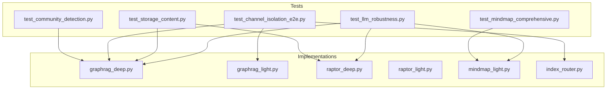

# Algorithms 测试增强设计文档

## 1. 概述

本设计文档描述了 `tests/core/algorithms/` 目录测试增强方案，旨在提升 RAPTOR、GraphRAG、MindMap 算法的测试覆盖率和健壮性验证。

### 1.1 设计目标

| 目标       | 描述                                  |
| :--------- | :------------------------------------ |
| 覆盖率提升 | MindMap 30% → 80%, GraphRAG 60% → 85% |
| 断言精确化 | 消除空操作断言，添加结构验证          |
| 健壮性验证 | LLM/JSON 异常、存储失败场景           |
| 隔离性验证 | Channel 隔离端到端验证                |

### 1.2 设计原则

1. **Property-Based Testing**: 使用 Hypothesis 生成随机输入验证通用属性
2. **最小 Mock**: 仅 mock 外部依赖（LLM、存储），保留核心逻辑
3. **确定性验证**: 对已知输入验证确定性输出
4. **分层测试**: 单元测试 → 集成测试 → 端到端测试

---

## 2. 架构

### 2.1 测试文件结构

```
tests/core/algorithms/
├── test_algorithms_real_docs.py      # 现有：真实文档集成测试
├── test_raptor_graphrag_comprehensive.py  # 现有：综合测试
├── test_mindmap_comprehensive.py     # 新增：MindMap 完整覆盖
├── test_community_detection.py       # 新增：社区检测精确验证
├── test_channel_isolation_e2e.py     # 新增：Channel 隔离端到端
├── test_storage_content.py           # 新增：存储内容结构验证
├── test_llm_robustness.py            # 新增：LLM/JSON 健壮性
└── conftest.py                       # 共享 fixtures
```

### 2.2 组件交互



---

## 3. 组件和接口

### 3.1 测试 Fixtures (conftest.py)

```python
@pytest.fixture
def mock_graph_with_communities():
    """生成已知社区结构的图"""
    # 两个断开的三角形 -> 应产生2个社区
    return {
        "nodes": [
            {"entity_name": "A1", "entity_type": "人物"},
            {"entity_name": "A2", "entity_type": "人物"},
            {"entity_name": "A3", "entity_type": "人物"},
            {"entity_name": "B1", "entity_type": "组织"},
            {"entity_name": "B2", "entity_type": "组织"},
            {"entity_name": "B3", "entity_type": "组织"},
        ],
        "edges": [
            {"src_id": "A1", "tgt_id": "A2", "weight": 1},
            {"src_id": "A2", "tgt_id": "A3", "weight": 1},
            {"src_id": "A3", "tgt_id": "A1", "weight": 1},
            {"src_id": "B1", "tgt_id": "B2", "weight": 1},
            {"src_id": "B2", "tgt_id": "B3", "weight": 1},
            {"src_id": "B3", "tgt_id": "B1", "weight": 1},
        ]
    }

@pytest.fixture
def mixed_channel_chunks():
    """生成混合 channel 的 chunks"""
    return [
        {"content": "张三在北京工作", "metadata": {"channel_id": "tenant_a"}},
        {"content": "李四在上海学习", "metadata": {"channel_id": "tenant_b"}},
        {"content": "王五是张三的同事", "metadata": {"channel_id": "tenant_a"}},
        {"content": "赵六是李四的朋友", "metadata": {"channel_id": "tenant_b"}},
    ]
```

### 3.2 Hypothesis Strategies

```python
from hypothesis import strategies as st

# 生成随机图节点
node_strategy = st.fixed_dictionaries({
    "entity_name": st.text(min_size=1, max_size=20),
    "entity_type": st.sampled_from(["人物", "组织", "地点", "事件"]),
    "description": st.text(max_size=100),
})

# 生成随机图
graph_strategy = st.fixed_dictionaries({
    "nodes": st.lists(node_strategy, min_size=1, max_size=50),
    "edges": st.lists(st.fixed_dictionaries({
        "src_id": st.text(min_size=1, max_size=20),
        "tgt_id": st.text(min_size=1, max_size=20),
        "weight": st.integers(min_value=1, max_value=10),
    }), max_size=100),
})

# 生成随机 MindMap topics
topic_strategy = st.fixed_dictionaries({
    "name": st.text(min_size=1, max_size=30),
    "subtopics": st.lists(st.text(min_size=1, max_size=20), max_size=5),
    "keywords": st.lists(st.text(min_size=1, max_size=10), max_size=5),
})
```

---

## 4. 数据模型

### 4.1 测试状态模型

```python
class TestGraphState(TypedDict):
    """GraphRAG 测试状态"""
    kb_name: str
    channel_id: str
    chunks: list[str]
    graph: dict[str, Any]  # {"nodes": [...], "edges": [...]}
    communities: list[dict[str, Any]]
    meta: dict[str, Any]

class TestMindMapState(TypedDict):
    """MindMap 测试状态"""
    kb_name: str
    chunks: list[str]
    topics: list[dict[str, Any]]
    mindmap: dict[str, Any]
    meta: dict[str, Any]
```

### 4.2 预期输出结构

```python
# Community 结构
ExpectedCommunity = {
    "id": int,
    "level": int,
    "members": list[str],
    "size": int,
    "top_entities": list[str],  # 可选
    "summary": str,  # 可选
}

# RAPTOR 存储结构
ExpectedRaptorOutput = {
    "layers": list[list[int]],
    "summaries": list[{"summary": str, "indices": list[int]}],
}

# GraphRAG 存储结构
ExpectedGraphOutput = {
    "nodes": list[{"entity_name": str, "entity_type": str, "description": str}],
    "edges": list[{"src_id": str, "tgt_id": str, "weight": int, "description": str}],
}
```

---

## 5. Correctness Properties

_A property is a characteristic or behavior that should hold true across all valid executions of a system-essentially, a formal statement about what the system should do. Properties serve as the bridge between human-readable specifications and machine-verifiable correctness guarantees._

### Property 1: Community Fallback Structure

_For any_ graph with N nodes, when networkx is unavailable, the fallback SHALL return exactly 1 community with N members and size=N.
**Validates: Requirements 2.1, 2.2**

### Property 2: Community Top Entities Ordering

_For any_ detected community, the top_entities list SHALL be ordered by node degree in descending order.
**Validates: Requirements 2.5**

### Property 3: Storage JSON Structure Validity

_For any_ stored RAPTOR/GraphRAG output, the JSON content SHALL contain all required fields (layers/summaries for RAPTOR, nodes/edges for GraphRAG).
**Validates: Requirements 4.1, 4.2, 4.3**

### Property 4: Meta Counts Consistency

_For any_ stored output, the meta counts (summary_count, node_count, edge_count, community_count) SHALL equal the actual array lengths.
**Validates: Requirements 4.4**

### Property 5: Channel Isolation in Graph Output

_For any_ mixed-channel input with specified channel_id, the output graph nodes and edges SHALL only contain entities extracted from chunks belonging to that channel.
**Validates: Requirements 6.1, 6.2, 6.3**

### Property 6: Light Defaults Application

_For any_ Light variant state without entity_types/max_cluster, the defaults SHALL be correctly applied before processing.
**Validates: Requirements 3.3**

### Property 7: LLM Error Graceful Degradation

_For any_ LLM error during extract_topics/summarize_groups/extract_graph, the system SHALL return well-formed empty output without crashing.
**Validates: Requirements 5.1, 5.3, 5.4**

### Property 8: MindMap Metadata Consistency

_For any_ stored mindmap, the meta SHALL contain mindmap_path pointing to valid file and topic_count matching topics array length.
**Validates: Requirements 1.3**

---

## 6. 错误处理

### 6.1 LLM 异常处理

| 异常类型       | 预期行为               | 测试方法                  |
| :------------- | :--------------------- | :------------------------ |
| LLM 超时       | 返回空结果，不崩溃     | Mock asyncio.TimeoutError |
| LLM 服务不可用 | 返回空结果，记录日志   | Mock Exception            |
| JSON 解析失败  | 跳过该 chunk，继续处理 | Mock 返回非 JSON 字符串   |

### 6.2 存储异常处理

| 异常类型     | 预期行为               | 测试方法                 |
| :----------- | :--------------------- | :----------------------- |
| 文件写入失败 | 抛出异常或返回错误状态 | Mock open() 抛出 IOError |
| 目录不存在   | 自动创建目录           | 验证 os.makedirs 调用    |

---

## 7. 测试策略

### 7.1 Property-Based Testing 配置

```python
from hypothesis import settings, given

# 配置 Hypothesis 运行 100 次迭代
@settings(max_examples=100)
@given(graph=graph_strategy)
def test_community_fallback_structure(graph):
    """
    **Feature: algorithms-test-review, Property 1: Community Fallback Structure**
    **Validates: Requirements 2.1, 2.2**
    """
    # ... test implementation
```

### 7.2 测试框架

- **Property-Based Testing**: Hypothesis (Python)
- **Unit Testing**: pytest
- **Mocking**: unittest.mock, pytest-mock
- **Async Testing**: pytest-asyncio

### 7.3 测试分类

| 类型              | 数量 | 覆盖范围     |
| :---------------- | :--: | :----------- |
| Property Tests    |  8   | 通用属性验证 |
| Unit Tests        |  12  | 特定场景验证 |
| Integration Tests |  4   | 端到端流程   |

### 7.4 测试命名规范

```python
# Property test 命名
def test_property_<property_number>_<short_description>():
    """
    **Feature: algorithms-test-review, Property N: Property Name**
    **Validates: Requirements X.Y**
    """

# Unit test 命名
def test_<function>_<scenario>_<expected_outcome>():
    """测试描述"""
```

---

## 8. 实现细节

### 8.1 Community Detection 精确验证

```python
@pytest.mark.asyncio
async def test_community_fallback_exact_structure():
    """
    **Feature: algorithms-test-review, Property 1: Community Fallback Structure**
    **Validates: Requirements 2.1, 2.2**
    """
    from core.algorithms.graphrag_deep import detect_communities

    state = {
        "graph": {
            "nodes": [
                {"entity_name": "A", "entity_type": "人物"},
                {"entity_name": "B", "entity_type": "组织"},
                {"entity_name": "C", "entity_type": "地点"},
            ],
            "edges": [{"src_id": "A", "tgt_id": "B", "weight": 1}]
        },
        "communities": [],
    }

    with patch.dict('sys.modules', {'networkx': None}):
        result = await detect_communities(state)

    # 精确断言
    assert len(result["communities"]) == 1
    community = result["communities"][0]
    assert community["id"] == 0
    assert community["level"] == 0
    assert set(community["members"]) == {"A", "B", "C"}
    assert community["size"] == 3
```

### 8.2 Channel 隔离端到端验证

```python
@pytest.mark.asyncio
async def test_channel_isolation_graph_output():
    """
    **Feature: algorithms-test-review, Property 5: Channel Isolation in Graph Output**
    **Validates: Requirements 6.1, 6.2, 6.3**
    """
    from core.algorithms.graphrag_deep import extract_graph

    # Mock LLM 返回基于 chunk 内容的实体
    async def mock_chat(*args, **kwargs):
        context = kwargs.get("context", "")
        if "张三" in context:
            return json.dumps({
                "entities": [{"name": "张三", "type": "人物", "desc": ""}],
                "relations": []
            })
        elif "李四" in context:
            return json.dumps({
                "entities": [{"name": "李四", "type": "人物", "desc": ""}],
                "relations": []
            })
        return json.dumps({"entities": [], "relations": []})

    with patch("core.algorithms.graphrag_deep.LLMGateway") as mock_gw:
        mock_gw.return_value.chat = mock_chat

        # 只处理 tenant_a 的 chunks
        state = {
            "chunks": ["张三在北京工作"],  # 仅 tenant_a 内容
            "graph": {},
        }

        result = await extract_graph(state)

        # 验证只有 tenant_a 的实体
        entity_names = [n["entity_name"] for n in result["graph"]["nodes"]]
        assert "张三" in entity_names
        assert "李四" not in entity_names
```

### 8.3 存储内容结构验证

```python
@pytest.mark.asyncio
async def test_raptor_storage_json_structure():
    """
    **Feature: algorithms-test-review, Property 3: Storage JSON Structure Validity**
    **Validates: Requirements 4.1**
    """
    from core.algorithms.raptor_deep import store_raptor
    import json

    written_content = []

    def mock_open(path, mode, **kwargs):
        mock_file = MagicMock()
        mock_file.__enter__ = MagicMock(return_value=mock_file)
        mock_file.__exit__ = MagicMock(return_value=False)

        def capture_write(content):
            written_content.append(content)

        mock_file.write = capture_write
        return mock_file

    with patch("builtins.open", mock_open):
        with patch("os.makedirs"):
            with patch("core.algorithms.raptor_deep.settings") as mock_settings:
                mock_settings.uploads_dir_resolved = "/tmp/test"

                state = {
                    "kb_name": "test_kb",
                    "layers": [[0, 1, 2], [0, 1]],
                    "summaries": [
                        {"summary": "摘要1", "indices": [0, 1]},
                        {"summary": "摘要2", "indices": [2]},
                    ],
                    "meta": {},
                }

                await store_raptor(state)

    # 验证 JSON 结构
    assert len(written_content) == 1
    data = json.loads(written_content[0])
    assert "layers" in data
    assert "summaries" in data
    assert isinstance(data["layers"], list)
    assert isinstance(data["summaries"], list)
    for summary in data["summaries"]:
        assert "summary" in summary
        assert "indices" in summary
```

---

## 9. 风险评估

| 风险                                | 概率 | 影响 | 缓解措施                     |
| :---------------------------------- | :--: | :--: | :--------------------------- |
| Hypothesis 生成边界值导致测试不稳定 |  中  |  低  | 设置 seed，限制生成范围      |
| Mock 过度导致测试与实现脱节         |  低  |  中  | 仅 mock 外部依赖             |
| 异步测试竞态条件                    |  低  |  中  | 使用 pytest-asyncio 正确配置 |

---

## 10. 依赖

### 10.1 测试依赖

```txt
# requirements-dev.txt 新增
hypothesis>=6.0.0
pytest-asyncio>=0.21.0
```

### 10.2 现有依赖

- pytest
- unittest.mock
- langgraph (可选，用于集成测试)
- networkx (可选，用于社区检测测试)
