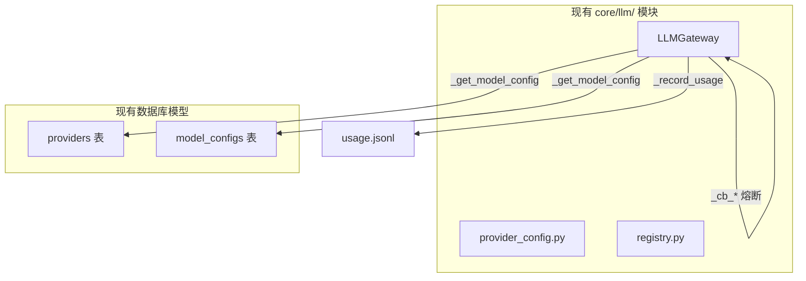
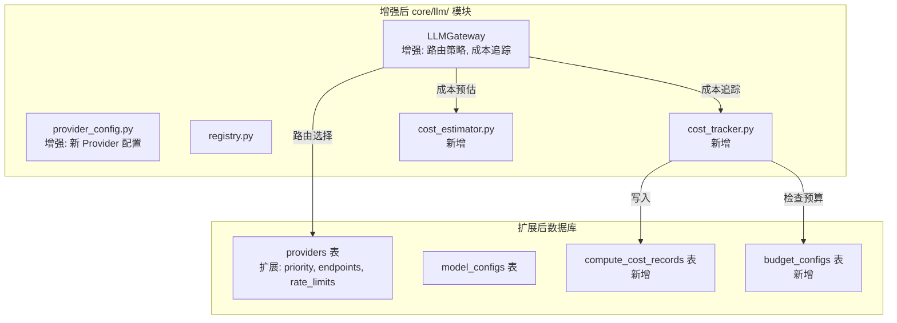

# Design Document

## Overview

本设计文档描述 OmniRAG 垂直领域增强第一阶段（Phase 1）的技术实现方案。核心目标是在现有架构基础上增强多云 Provider 支持、成本追踪和预算控制功能。

**关键架构决策：**

- 增强现有 `core/llm/` 模块，不创建新的 `core/compute/` 模块
- 扩展现有 `providers` 表，不创建新的 `compute_providers` 表
- 复用现有的熔断/降级机制

## Architecture

### 现有架构分析



### 增强后架构



## Components and Interfaces

### 1. LLMGateway 增强 (core/llm/gateway.py)

```python
class LLMGateway:
    """
    增强后的 LLM 网关
    新增功能：路由策略、成本追踪、预算检查
    """

    def __init__(
        self,
        provider: str | None = None,
        model: str | None = None,
        # 新增参数
        routing_strategy: str = "default",  # cost_first, performance_first, balanced
        channel_id: str | None = None,
        enable_cost_tracking: bool = True,
    ):
        # 现有初始化...
        self.routing_strategy = routing_strategy
        self.channel_id = channel_id
        self.enable_cost_tracking = enable_cost_tracking
        self._cost_tracker = None

    @property
    def cost_tracker(self) -> "CostTracker":
        """延迟加载 CostTracker"""
        if self._cost_tracker is None:
            from core.llm.cost_tracker import get_cost_tracker
            self._cost_tracker = get_cost_tracker()
        return self._cost_tracker

    async def _select_provider(self, task_type: str = "chat") -> tuple[Provider, ModelConfig]:
        """
        根据路由策略选择 Provider
        新增方法
        """
        if self.routing_strategy == "cost_first":
            return await self._select_cheapest_provider(task_type)
        elif self.routing_strategy == "performance_first":
            return await self._select_fastest_provider(task_type)
        else:
            return await self._get_model_config(
                self.default_provider_name,
                self.default_model_name
            )

    async def _check_budget(self) -> bool:
        """
        检查预算是否允许调用
        新增方法
        """
        if not self.enable_cost_tracking:
            return True
        allowed, _ = self.cost_tracker.check_budget(self.channel_id)
        return allowed

    async def chat(self, prompt: str, context: str | None = None) -> str:
        """
        增强后的 chat 方法
        新增：预算检查、成本追踪
        """
        # 预算检查
        if not await self._check_budget():
            raise BudgetExceededError(f"Budget exceeded for channel: {self.channel_id}")

        t0 = time.perf_counter()

        # 选择 Provider（使用路由策略）
        prov, mdl = await self._select_provider("chat")

        # ... 现有调用逻辑 ...

        # 成本追踪（新增）
        if self.enable_cost_tracking:
            self._track_cost(
                provider=prov,
                model=mdl,
                task_type="chat",
                input_tokens=len(content) // 4,
                output_tokens=len(out) // 4,
                latency_ms=int((time.perf_counter() - t0) * 1000),
                success=True
            )

        return out

    def _track_cost(
        self,
        provider: Provider,
        model: ModelConfig,
        task_type: str,
        input_tokens: int,
        output_tokens: int,
        latency_ms: int,
        success: bool,
        error_message: str | None = None
    ):
        """记录成本到数据库"""
        from core.llm.cost_tracker import CostRecord

        # 计算成本
        cost_usd = self._calculate_cost(model, input_tokens, output_tokens)

        record = CostRecord(
            request_id=str(uuid.uuid4()),
            provider_id=provider.name,
            model_id=model.model_id,
            task_type=task_type,
            input_tokens=input_tokens,
            output_tokens=output_tokens,
            image_count=0,
            cost_usd=cost_usd,
            latency_ms=latency_ms,
            success=success,
            cached=False,
            error_message=error_message,
            channel_id=self.channel_id,
        )
        self.cost_tracker.track(record)
```

### 2. CostTracker (core/llm/cost_tracker.py) - 新增

```python
"""
成本追踪器 - 记录 API 调用成本到数据库
"""
from dataclasses import dataclass
from datetime import datetime
from typing import Optional
import uuid

from sqlalchemy import text
from server.database import AsyncSessionLocal


@dataclass
class CostRecord:
    """成本记录数据类"""
    request_id: str
    provider_id: str
    model_id: str
    task_type: str
    input_tokens: int
    output_tokens: int
    image_count: int
    cost_usd: float
    latency_ms: int
    success: bool
    cached: bool = False
    error_message: Optional[str] = None
    channel_id: Optional[str] = None
    user_id: Optional[str] = None


class CostTracker:
    """成本追踪器"""

    async def track(self, record: CostRecord) -> None:
        """记录成本到数据库"""
        async with AsyncSessionLocal() as session:
            await session.execute(
                text("""
                    INSERT INTO compute_cost_records (
                        request_id, channel_id, user_id,
                        provider_id, model_id, task_type,
                        input_tokens, output_tokens, image_count,
                        cost_usd, latency_ms, cached, success, error_message
                    ) VALUES (
                        :request_id, :channel_id, :user_id,
                        :provider_id, :model_id, :task_type,
                        :input_tokens, :output_tokens, :image_count,
                        :cost_usd, :latency_ms, :cached, :success, :error_message
                    )
                """),
                {
                    "request_id": record.request_id,
                    "channel_id": record.channel_id,
                    "user_id": record.user_id,
                    "provider_id": record.provider_id,
                    "model_id": record.model_id,
                    "task_type": record.task_type,
                    "input_tokens": record.input_tokens,
                    "output_tokens": record.output_tokens,
                    "image_count": record.image_count,
                    "cost_usd": record.cost_usd,
                    "latency_ms": record.latency_ms,
                    "cached": record.cached,
                    "success": record.success,
                    "error_message": record.error_message,
                }
            )
            await session.commit()

    async def get_daily_cost(
        self,
        date: datetime | None = None,
        channel_id: str | None = None
    ) -> float:
        """获取每日成本"""
        date = date or datetime.now()
        date_str = date.strftime("%Y-%m-%d")

        query = """
            SELECT COALESCE(SUM(cost_usd), 0) as total
            FROM compute_cost_records
            WHERE DATE(created_at) = :date
        """
        params = {"date": date_str}

        if channel_id:
            query += " AND channel_id = :channel_id"
            params["channel_id"] = channel_id

        async with AsyncSessionLocal() as session:
            result = await session.execute(text(query), params)
            row = result.fetchone()
            return float(row[0]) if row else 0.0

    async def check_budget(self, channel_id: str | None = None) -> tuple[bool, float]:
        """检查预算是否超限"""
        scope = "channel" if channel_id else "global"

        async with AsyncSessionLocal() as session:
            result = await session.execute(
                text("""
                    SELECT daily_limit, hard_stop_threshold
                    FROM budget_configs
                    WHERE scope = :scope
                    AND (scope_id = :scope_id OR scope_id IS NULL)
                    AND is_active = true
                    ORDER BY scope_id NULLS LAST
                    LIMIT 1
                """),
                {"scope": scope, "scope_id": channel_id}
            )
            config = result.fetchone()

        if not config:
            return True, 100.0  # 无预算配置，允许

        daily_cost = await self.get_daily_cost(channel_id=channel_id)
        daily_limit = float(config[0])
        hard_stop = float(config[1])
        remaining = daily_limit - daily_cost

        if daily_cost >= daily_limit * hard_stop:
            return False, remaining

        return True, remaining


# 全局实例
_tracker: Optional[CostTracker] = None


def get_cost_tracker() -> CostTracker:
    global _tracker
    if _tracker is None:
        _tracker = CostTracker()
    return _tracker
```

### 3. CostEstimator (core/llm/cost_estimator.py) - 新增

```python
"""
成本估算器 - 在调用前预估成本
"""
from typing import Optional
from server.database import AsyncSessionLocal
from sqlalchemy import text


class CostEstimator:
    """成本估算器"""

    # 默认成本配置（每 1K tokens，USD）
    DEFAULT_COSTS = {
        "dashscope": {
            "qwen-max": {"input": 0.02, "output": 0.06},
            "qwen-plus": {"input": 0.004, "output": 0.012},
            "qwen-turbo": {"input": 0.002, "output": 0.006},
        },
        "deepseek": {
            "deepseek-chat": {"input": 0.0001, "output": 0.0002},
            "deepseek-reasoner": {"input": 0.0004, "output": 0.0016},
        },
        "volcengine": {
            "doubao-pro-256k": {"input": 0.005, "output": 0.009},
            "doubao-lite-128k": {"input": 0.0008, "output": 0.001},
        },
    }

    def estimate(
        self,
        provider_id: str,
        model_id: str,
        input_tokens: int,
        output_tokens: int = 0,
        image_count: int = 0
    ) -> float:
        """估算成本"""
        provider_costs = self.DEFAULT_COSTS.get(provider_id, {})
        model_costs = provider_costs.get(model_id, {"input": 0.01, "output": 0.03})

        input_cost = (input_tokens / 1000) * model_costs["input"]
        output_cost = (output_tokens / 1000) * model_costs["output"]

        return input_cost + output_cost

    def get_cheapest_provider(
        self,
        task_type: str = "chat",
        estimated_tokens: int = 1000
    ) -> tuple[str, str]:
        """获取最便宜的 Provider"""
        min_cost = float("inf")
        best_provider = "dashscope"
        best_model = "qwen-turbo"

        for provider_id, models in self.DEFAULT_COSTS.items():
            for model_id, costs in models.items():
                cost = (estimated_tokens / 1000) * (costs["input"] + costs["output"])
                if cost < min_cost:
                    min_cost = cost
                    best_provider = provider_id
                    best_model = model_id

        return best_provider, best_model


def get_cost_estimator() -> CostEstimator:
    return CostEstimator()
```

## Data Models

### 1. 扩展 Provider 模型 (server/models.py)

```python
class Provider(Base):
    __tablename__ = "providers"

    # 现有字段
    id = Column(PGUUID(as_uuid=True), primary_key=True, default=uuid.uuid4)
    name = Column(String(100), unique=True, nullable=False)
    description = Column(Text)
    category = Column(String(50), nullable=False)  # llm, embedding, reranker, ocr
    base_url = Column(String(500))
    api_key = Column(String(500))
    config_schema = Column(JSON, default={})
    is_active = Column(Boolean, default=True)
    created_at = Column(DateTime(timezone=True), server_default=func.now())
    updated_at = Column(DateTime(timezone=True), onupdate=func.now())

    # 新增字段
    priority = Column(Integer, default=10)  # 路由优先级，数字越小优先级越高
    endpoints = Column(JSON, default={})  # {"chat": "...", "embedding": "...", "vision": "..."}
    rate_limits = Column(JSON, default={})  # {"rpm": 1000, "tpm": 1000000}
    is_healthy = Column(Boolean, default=True)
    last_health_check = Column(DateTime(timezone=True))
    circuit_breaker_failures = Column(Integer, default=0)
    circuit_breaker_open_until = Column(DateTime(timezone=True))
```

### 2. 新增 ComputeCostRecord 模型

```python
class ComputeCostRecord(Base):
    __tablename__ = "compute_cost_records"

    id = Column(Integer, primary_key=True, autoincrement=True)
    request_id = Column(String(100), nullable=False)
    channel_id = Column(String(100))
    user_id = Column(String(100))
    provider_id = Column(String(100), nullable=False)
    model_id = Column(String(100), nullable=False)
    task_type = Column(String(50), nullable=False)  # chat, embedding, vision
    input_tokens = Column(Integer, default=0)
    output_tokens = Column(Integer, default=0)
    image_count = Column(Integer, default=0)
    cost_usd = Column(Numeric(10, 6), nullable=False)
    latency_ms = Column(Integer)
    cached = Column(Boolean, default=False)
    success = Column(Boolean, nullable=False)
    error_message = Column(Text)
    created_at = Column(DateTime(timezone=True), server_default=func.now())
```

### 3. 新增 BudgetConfig 模型

```python
class BudgetConfig(Base):
    __tablename__ = "budget_configs"

    id = Column(Integer, primary_key=True, autoincrement=True)
    scope = Column(String(50), nullable=False)  # global, channel, user
    scope_id = Column(String(100))  # channel_id 或 user_id
    daily_limit = Column(Numeric(10, 2))
    monthly_limit = Column(Numeric(10, 2))
    alert_threshold = Column(Numeric(3, 2), default=0.80)
    hard_stop_threshold = Column(Numeric(3, 2), default=0.95)
    is_active = Column(Boolean, default=True)
    created_at = Column(DateTime(timezone=True), server_default=func.now())
    updated_at = Column(DateTime(timezone=True), onupdate=func.now())

    __table_args__ = (
        UniqueConstraint('scope', 'scope_id', name='uq_budget_scope'),
    )
```

### 4. 新增 DomainConfig 模型（为 Phase 2+ 预留）

```python
class DomainConfig(Base):
    __tablename__ = "domain_configs"

    id = Column(String(100), primary_key=True)  # metaphysics_chinese, comic_four_panel
    name = Column(String(200), nullable=False)
    name_en = Column(String(200))
    ontology = Column(JSON, nullable=False)
    visual_schema = Column(JSON)
    narrative_schema = Column(JSON)
    interpretation_rules = Column(JSON)
    gpu_requirements = Column(JSON)  # {"min_vram_gb": 8, "recommended_vram_gb": 24}
    enabled = Column(Boolean, default=True)
    created_at = Column(DateTime(timezone=True), server_default=func.now())
    updated_at = Column(DateTime(timezone=True), onupdate=func.now())
```

## Correctness Properties

_A property is a characteristic or behavior that should hold true across all valid executions of a system-essentially, a formal statement about what the system should do. Properties serve as the bridge between human-readable specifications and machine-verifiable correctness guarantees._

### Property Reflection

After analyzing the acceptance criteria, I identified the following redundancies:

- Properties 4.3, 6.5, and 7.3 all test cost tracking after API calls - can be combined
- Properties 4.2, 6.4, and 7.5 all test failover behavior - can be combined
- Properties 5.2 and 2.5 both test cost aggregation - can be combined

### Correctness Properties

**Property 1: Cost Record Round Trip**
_For any_ cost record written to the database, reading it back should return an equivalent record with all fields preserved.
**Validates: Requirements 2.2, 5.1**

**Property 2: Daily Cost Aggregation Consistency**
_For any_ set of cost records on a given date, the daily cost returned by `get_daily_cost()` should equal the sum of all `cost_usd` values for that date.
**Validates: Requirements 2.5, 5.2**

**Property 3: Budget Check Correctness**
_For any_ budget configuration with daily_limit and hard_stop_threshold, when daily cost >= daily_limit \* hard_stop_threshold, `check_budget()` should return (False, remaining).
**Validates: Requirements 5.3, 5.4**

**Property 4: Provider Configuration Completeness**
_For any_ provider in the configuration, it should contain all required fields: base_url or base_url_env, api_key_env, models, category, and priority.
**Validates: Requirements 3.2**

**Property 5: Environment Variable Validation**
_For any_ provider, `validate_provider()` should correctly identify all missing required environment variables.
**Validates: Requirements 3.4**

**Property 6: Routing Strategy Selection**
_For any_ routing strategy (cost_first, performance_first, balanced), the gateway should select a provider according to that strategy's criteria.
**Validates: Requirements 4.1**

**Property 7: Failover Chain Correctness**
_For any_ unhealthy primary provider, the system should automatically select the next healthy provider in the failover chain.
**Validates: Requirements 4.2, 6.4, 7.5**

**Property 8: Cost Tracking Integration**
_For any_ API call with cost tracking enabled, a cost record should be created in the database with correct provider_id, model_id, and cost_usd.
**Validates: Requirements 4.3, 6.5, 7.3**

**Property 9: Budget Enforcement**
_For any_ scope where daily cost exceeds hard_stop_threshold, new API calls should be rejected with BudgetExceededError.
**Validates: Requirements 4.4**

**Property 10: Backward Compatibility**
_For any_ existing API call pattern (e.g., `gateway.chat(prompt, context)`), the enhanced gateway should produce equivalent results.
**Validates: Requirements 4.5**

## Error Handling

### Budget Exceeded Error

```python
class BudgetExceededError(Exception):
    """Raised when budget limit is exceeded"""
    def __init__(self, message: str, scope: str = "global", remaining: float = 0.0):
        super().__init__(message)
        self.scope = scope
        self.remaining = remaining
```

### Provider Unavailable Error

```python
class ProviderUnavailableError(Exception):
    """Raised when no healthy provider is available"""
    def __init__(self, message: str, tried_providers: list[str]):
        super().__init__(message)
        self.tried_providers = tried_providers
```

### Error Handling Strategy

1. **Budget Exceeded**: Reject request immediately, log warning
2. **Provider Failure**: Trigger circuit breaker, try failover chain
3. **All Providers Failed**: Raise ProviderUnavailableError
4. **Database Error**: Log error, continue without cost tracking (graceful degradation)

## Testing Strategy

### Dual Testing Approach

本项目采用单元测试和属性测试相结合的方式：

- **单元测试**: 验证具体示例和边界情况
- **属性测试**: 验证通用属性在所有输入上成立

### Property-Based Testing Framework

使用 **Hypothesis** 作为属性测试框架（Python 生态系统中最成熟的 PBT 库）。

```python
# pytest.ini 配置
[pytest]
markers =
    property: Property-based tests
    integration: Integration tests requiring real API
```

### Test Structure

```
tests/
├── core/
│   └── llm/
│       ├── test_cost_tracker.py          # CostTracker 单元测试
│       ├── test_cost_tracker_property.py # CostTracker 属性测试
│       ├── test_cost_estimator.py        # CostEstimator 单元测试
│       ├── test_gateway_enhanced.py      # Gateway 增强功能测试
│       └── test_gateway_property.py      # Gateway 属性测试
├── integration/
│   ├── test_provider_real_api.py         # 真实 API 集成测试
│   └── test_phase1_e2e.py                # E2E 测试
└── conftest.py
```

### Property Test Examples

```python
# tests/core/llm/test_cost_tracker_property.py
from hypothesis import given, strategies as st
from core.llm.cost_tracker import CostRecord, CostTracker

class TestCostTrackerProperties:
    """
    **Feature: vertical-domain-phase1, Property 1: Cost Record Round Trip**
    **Validates: Requirements 2.2, 5.1**
    """

    @given(
        provider_id=st.sampled_from(["dashscope", "deepseek", "volcengine"]),
        model_id=st.text(min_size=1, max_size=50),
        input_tokens=st.integers(min_value=0, max_value=100000),
        output_tokens=st.integers(min_value=0, max_value=100000),
        cost_usd=st.floats(min_value=0, max_value=100, allow_nan=False),
    )
    async def test_cost_record_round_trip(
        self, provider_id, model_id, input_tokens, output_tokens, cost_usd
    ):
        """Cost record round trip: write then read should preserve data"""
        tracker = CostTracker()

        record = CostRecord(
            request_id=str(uuid.uuid4()),
            provider_id=provider_id,
            model_id=model_id,
            task_type="chat",
            input_tokens=input_tokens,
            output_tokens=output_tokens,
            image_count=0,
            cost_usd=cost_usd,
            latency_ms=100,
            success=True,
        )

        await tracker.track(record)

        # Read back and verify
        # ... verification logic
```

### Unit Test Examples

```python
# tests/core/llm/test_cost_tracker.py
import pytest
from core.llm.cost_tracker import CostTracker, CostRecord

class TestCostTracker:
    """CostTracker 单元测试"""

    @pytest.fixture
    async def tracker(self):
        return CostTracker()

    async def test_track_creates_record(self, tracker):
        """验证 track() 创建记录"""
        record = CostRecord(
            request_id="test-001",
            provider_id="dashscope",
            model_id="qwen-turbo",
            task_type="chat",
            input_tokens=100,
            output_tokens=50,
            image_count=0,
            cost_usd=0.0003,
            latency_ms=200,
            success=True
        )

        await tracker.track(record)

        # Verify record exists
        daily_cost = await tracker.get_daily_cost()
        assert daily_cost >= 0.0003

    async def test_budget_check_allows_under_limit(self, tracker):
        """验证预算未超时允许"""
        allowed, remaining = await tracker.check_budget()
        assert allowed is True
        assert remaining > 0
```

### Integration Test Examples

```python
# tests/integration/test_provider_real_api.py
import pytest
import os

pytestmark = pytest.mark.integration

class TestRealProviderAPI:
    """真实 Provider API 测试"""

    @pytest.fixture
    def dashscope_gateway(self):
        api_key = os.environ.get("DASHSCOPE_API_KEY")
        if not api_key:
            pytest.skip("DASHSCOPE_API_KEY not set")
        from core.llm.gateway import LLMGateway
        return LLMGateway(provider="dashscope")

    async def test_dashscope_chat_real(self, dashscope_gateway):
        """DashScope 真实 Chat API 调用"""
        response = await dashscope_gateway.chat(
            prompt="Say 'Hello OmniRAG' in exactly 3 words"
        )
        assert response is not None
        assert len(response) > 0
```

### Test Configuration

每个属性测试配置运行至少 100 次迭代：

```python
# conftest.py
from hypothesis import settings

settings.register_profile("ci", max_examples=100)
settings.register_profile("dev", max_examples=20)
settings.load_profile(os.getenv("HYPOTHESIS_PROFILE", "dev"))
```
