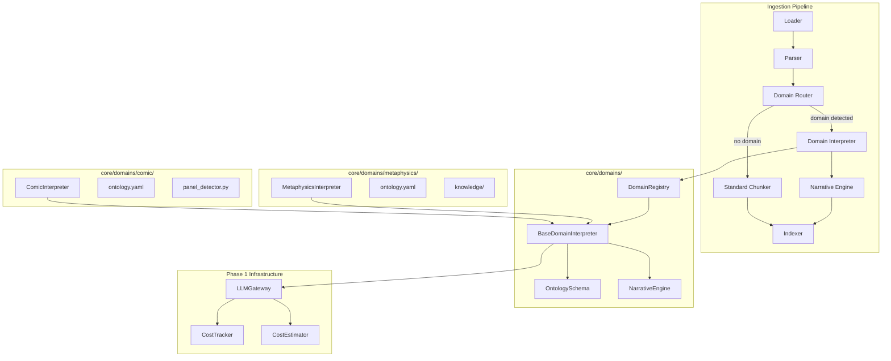

# Design Document: Vertical Domain Phase 2

## Overview

Phase 2 在 Phase 1 多云算力基础设施之上，构建统一的领域解读基座。核心目标是让 OmniRAG 具备垂直场景的深度解读能力，而非简单的文本提取。

关键设计决策：

1. **不新建平行实现**：在 `core/domains/` 下构建共同基座，领域差分放 `core/domains/{domain}/`
2. **复用 Phase 1 基础设施**：使用已实现的 LLMGateway、CostTracker、CostEstimator
3. **渐进式增强**：先实现框架，再实现具体领域（命理、漫画）

## Architecture



## Components and Interfaces

### 1. DomainRegistry (`core/domains/registry.py`)

```python
class DomainRegistry:
    """领域解读器注册表"""

    _interpreters: dict[str, type[BaseDomainInterpreter]]
    _ontologies: dict[str, OntologySchema]

    def register(self, domain_id: str, interpreter_class: type, ontology_path: str) -> None
    def get_interpreter(self, domain_id: str) -> BaseDomainInterpreter | None
    def detect_domain(self, document: dict) -> str | None
    def list_domains(self) -> list[str]
```

### 2. BaseDomainInterpreter (`core/domains/base_interpreter.py`)

```python
@dataclass
class InterpretationResult:
    """领域解读结果"""
    domain_id: str
    structured_data: dict[str, Any]
    narrative: str
    confidence: float
    metadata: dict[str, Any]
    raw_elements: list[dict]

class BaseDomainInterpreter(ABC):
    """领域解读器基类"""

    domain_id: str
    requires_gpu: bool = False
    recommended_vram_mb: int = 0

    @abstractmethod
    async def interpret(self, document: dict, config: dict | None = None) -> InterpretationResult

    @abstractmethod
    def get_ontology(self) -> OntologySchema

    @abstractmethod
    def validate_output(self, result: InterpretationResult) -> tuple[bool, list[str]]

    async def _call_vlm(self, image_data: bytes, prompt: str) -> str:
        """使用 Phase 1 Gateway 调用 VLM"""

    async def _call_llm(self, prompt: str, context: str | None = None) -> str:
        """使用 Phase 1 Gateway 调用 LLM"""
```

### 3. OntologySchema (`core/domains/ontology_schema.py`)

```python
@dataclass
class EntityType:
    name: str
    fields: dict[str, FieldSpec]
    required: list[str]

@dataclass
class Relationship:
    name: str
    source_type: str
    target_type: str
    cardinality: str  # "one", "many"

class OntologySchema:
    """本体定义"""

    entity_types: dict[str, EntityType]
    relationships: list[Relationship]
    validation_rules: list[ValidationRule]

    @classmethod
    def from_yaml(cls, path: str) -> "OntologySchema"

    def validate(self, data: dict) -> tuple[bool, list[str]]
```

### 4. NarrativeEngine (`core/domains/narrative_engine.py`)

```python
class NarrativeEngine:
    """叙事引擎"""

    def __init__(self, gateway: LLMGateway | None = None):
        self.gateway = gateway
        self._templates: dict[str, str] = {}

    async def generate(
        self,
        structured_data: dict,
        domain_id: str,
        detail_level: Literal["brief", "detailed", "comprehensive"] = "detailed",
        use_llm: bool = True
    ) -> str

    def register_template(self, domain_id: str, template: str) -> None

    def _template_fallback(self, structured_data: dict, domain_id: str) -> str
```

### 5. MetaphysicsInterpreter (`core/domains/metaphysics/interpreter.py`)

```python
class MetaphysicsInterpreter(BaseDomainInterpreter):
    """命理解读器"""

    domain_id = "metaphysics"
    requires_gpu = True
    recommended_vram_mb = 4096

    async def interpret(self, document: dict, config: dict | None = None) -> InterpretationResult:
        # 1. 提取文本中的命理元素
        # 2. 使用 VLM 解析图像中的命盘
        # 3. 应用命理规则生成解读
        # 4. 生成叙事文本
```

### 6. ComicInterpreter (`core/domains/comic/interpreter.py`)

```python
class ComicInterpreter(BaseDomainInterpreter):
    """漫画解读器"""

    domain_id = "comic"
    requires_gpu = True
    recommended_vram_mb = 8192

    async def interpret(self, document: dict, config: dict | None = None) -> InterpretationResult:
        # 1. 检测分格边界
        # 2. OCR 提取对话
        # 3. VLM 描述场景
        # 4. 构建故事叙事
```

## Data Models

### InterpretationResult

```python
@dataclass
class InterpretationResult:
    domain_id: str                    # 领域标识
    structured_data: dict[str, Any]   # 结构化数据（符合本体定义）
    narrative: str                    # 叙事文本
    confidence: float                 # 置信度 0-1
    metadata: dict[str, Any]          # 元数据（处理时间、模型等）
    raw_elements: list[dict]          # 原始提取元素
```

### Ontology YAML Schema

```yaml
# core/domains/metaphysics/ontology.yaml
domain_id: metaphysics
version: "1.0"

entity_types:
  bazi:
    description: "八字命盘"
    fields:
      year_pillar:
        {
          type: string,
          pattern: "^[甲乙丙丁戊己庚辛壬癸][子丑寅卯辰巳午未申酉戌亥]$",
        }
      month_pillar: { type: string }
      day_pillar: { type: string }
      hour_pillar: { type: string }
    required: [year_pillar, month_pillar, day_pillar]

  wuxing:
    description: "五行分析"
    fields:
      metal: { type: integer, minimum: 0, maximum: 8 }
      wood: { type: integer, minimum: 0, maximum: 8 }
      water: { type: integer, minimum: 0, maximum: 8 }
      fire: { type: integer, minimum: 0, maximum: 8 }
      earth: { type: integer, minimum: 0, maximum: 8 }
    required: [metal, wood, water, fire, earth]

relationships:
  - name: has_wuxing
    source_type: bazi
    target_type: wuxing
    cardinality: one

validation_rules:
  - rule: "sum(wuxing.values) == 8"
    message: "五行总数必须为8"
```

## Correctness Properties

_A property is a characteristic or behavior that should hold true across all valid executions of a system-essentially, a formal statement about what the system should do. Properties serve as the bridge between human-readable specifications and machine-verifiable correctness guarantees._

Based on the prework analysis, the following consolidated properties will be tested:

### Property 1: Domain Registration Round Trip

_For any_ domain interpreter class and ontology configuration, registering it with the DomainRegistry and then retrieving it should return an equivalent interpreter instance.

**Validates: Requirements 1.1, 1.2**

### Property 2: Interpretation Result Completeness

_For any_ document processed by any domain interpreter, the returned InterpretationResult should contain non-empty domain_id, structured_data dict, narrative string, and confidence between 0 and 1.

**Validates: Requirements 1.3, 2.2, 5.4**

### Property 3: Ontology Validation Correctness

_For any_ structured data and ontology schema, validation should correctly identify all schema violations including missing required fields, invalid enum values, and type mismatches.

**Validates: Requirements 3.2, 3.3, 3.4, 3.5**

### Property 4: Narrative Generation Respects Detail Level

_For any_ structured data and detail_level parameter, the generated narrative length should be: brief < detailed < comprehensive.

**Validates: Requirements 4.1, 4.5**

### Property 5: GPU Fallback to Cloud Provider

_For any_ domain interpreter that requires GPU, when GPU is unavailable, the system should automatically route VLM calls to cloud providers using Phase 1 infrastructure.

**Validates: Requirements 1.5, 7.2**

### Property 6: Cost Estimation Before Execution

_For any_ cloud API call made by a domain interpreter, the cost_estimator should be invoked before execution, and budget check should occur.

**Validates: Requirements 7.3, 7.4, 7.5**

### Property 7: Pipeline Integration Resilience

_For any_ document where domain interpretation fails, the ingestion pipeline should continue with standard processing and not raise an exception to the caller.

**Validates: Requirements 8.5**

## Error Handling

### Custom Exceptions

```python
class DomainInterpretationError(Exception):
    """领域解读错误"""
    def __init__(self, message: str, domain_id: str, stage: str, details: dict | None = None):
        self.domain_id = domain_id
        self.stage = stage
        self.details = details or {}
        super().__init__(message)

class OntologyValidationError(Exception):
    """本体验证错误"""
    def __init__(self, message: str, violations: list[str]):
        self.violations = violations
        super().__init__(message)

class DomainNotFoundError(Exception):
    """领域未找到错误"""
    pass
```

### Error Recovery Strategy

1. **VLM 调用失败**：回退到 OCR + 规则提取
2. **LLM 调用失败**：使用模板生成叙事
3. **本体验证失败**：记录警告，返回部分结果
4. **整体解读失败**：回退到标准文本处理

## Testing Strategy

### Dual Testing Approach

本设计采用单元测试和属性测试相结合的方式：

**单元测试**：

- 验证具体示例的正确行为
- 测试边界条件和错误处理
- 集成点测试

**属性测试**：

- 使用 Hypothesis 库进行属性测试
- 每个属性测试运行至少 100 次迭代
- 测试标注格式：`**Feature: vertical-domain-phase2, Property {number}: {property_text}**`

### Test Files Structure

```
tests/core/domains/
├── test_registry.py              # DomainRegistry 单元测试
├── test_registry_property.py     # Property 1
├── test_base_interpreter.py      # BaseDomainInterpreter 单元测试
├── test_interpretation_property.py # Property 2
├── test_ontology_schema.py       # OntologySchema 单元测试
├── test_ontology_property.py     # Property 3
├── test_narrative_engine.py      # NarrativeEngine 单元测试
├── test_narrative_property.py    # Property 4
├── test_gpu_fallback_property.py # Property 5
├── test_cost_integration_property.py # Property 6
├── test_pipeline_resilience_property.py # Property 7
├── metaphysics/
│   ├── test_interpreter.py
│   └── test_real_samples.py      # 真实样本测试
└── comic/
    ├── test_interpreter.py
    ├── test_panel_detector.py
    └── test_real_samples.py      # 真实样本测试
```

### Real Sample Requirements

- **命理领域**：最小 10 条真实样例（含 PDF 和图像）
- **漫画领域**：最小 20 张真实样例（含四格漫画）
- 所有样本需脱敏处理
- 提供样本清单文档
