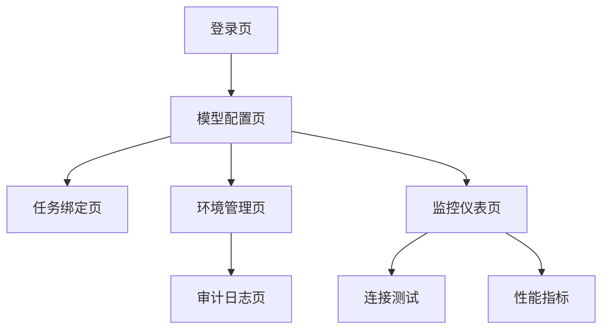

## 1. 产品概述

模型网关配置页是OmniRAG系统的核心管理界面，用于统一管理国内外AI模型的配置、测试和监控。系统采用中/英双栈分集合架构，优先保障国内模型的TTFT（首token延迟）、稳定性和功能范围，同时支持海外模型作为备选方案。

## 2. 核心功能

### 2.1 用户角色

| 角色       | 注册方式 | 核心权限                             |
| ---------- | -------- | ------------------------------------ |
| 系统管理员 | 预置账户 | 全权限：模型配置、环境管理、审计查看 |
| 配置管理员 | 邀请注册 | 模型配置、连接测试、指标查看         |
| 只读用户   | 邮箱注册 | 查看配置、查看指标                   |

### 2.2 功能模块

模型网关配置页包含以下核心页面：

1. **模型配置页**：双栈模型管理、Tab分组展示、配置项维护
2. **任务绑定页**：模型与处理任务关联配置
3. **环境管理页**：分环境配置管理、版本控制
4. **监控仪表页**：连接测试、性能指标、质量门状态
5. **审计日志页**：操作记录、变更追踪、权限审计

### 2.3 页面详情

| 页面名称   | 模块名称       | 功能描述                               |
| ---------- | -------------- | -------------------------------------- |
| 模型配置页 | 双栈分集合管理 | 创建/编辑中/英模型集合，设置优先级策略 |
| 模型配置页 | Tab分组展示    | 按模型类型、厂商、性能指标分组展示     |
| 模型配置页 | 配置项维护     | 模型地址、认证信息、参数模板配置       |
| 任务绑定页 | 任务模型映射   | 将文档处理任务绑定到指定模型集合       |
| 任务绑定页 | 优先级规则     | 设置模型选择优先级和降级策略           |
| 环境管理页 | 多环境配置     | 开发、测试、生产环境隔离管理           |
| 环境管理页 | 版本控制       | 配置变更版本管理和回滚                 |
| 监控仪表页 | 连接测试       | 实时测试模型连通性和响应时间           |
| 监控仪表页 | 性能指标       | TTFT、吞吐量、错误率实时监控           |
| 监控仪表页 | 质量门状态     | 模型质量评估和准入门槛展示             |
| 审计日志页 | 操作记录       | 用户操作完整记录和查询                 |
| 审计日志页 | 变更追踪       | 配置变更diff和影响分析                 |

## 3. 核心流程

### 系统管理员流程

登录系统 → 创建模型集合（中/英双栈）→ 配置模型参数 → 设置环境隔离 → 绑定处理任务 → 质量测试 → 发布配置

### 配置管理员流程

查看模型列表 → 编辑模型配置 → 执行连接测试 → 查看性能指标 → 提交变更申请

### 页面导航流程

## 4. 用户界面设计

### 4.1 设计规范

- **主色调**：科技蓝 (#1890ff) + 深空灰 (#141414)

- **按钮样式**：圆角矩形，主按钮使用渐变色

- **字体**：系统字体栈，主要14px，标题16px

- **布局**：卡片式布局，左侧导航 + 右侧内容区

- **图标**：使用Ant Design图标库，保持风格统一

### 4.2 页面设计概览

| 页面名称   | 模块名称 | UI元素                                           |
| ---------- | -------- | ------------------------------------------------ |
| 模型配置页 | 双栈管理 | 顶部Tab切换中/英，左侧树形模型列表，右侧配置表单 |
| 模型配置页 | 配置表单 | 分栏布局：基础信息、认证配置、参数模板           |
| 监控仪表页 | 指标卡片 | 四色卡片展示TTFT、吞吐量、错误率、质量分数       |
| 任务绑定页 | 任务列表 | 表格展示任务名称、绑定模型、优先级、状态         |
| 环境管理页 | 环境切换 | 顶部环境选择器，下方配置对比视图                 |

### 4.3 响应式设计

- **桌面优先**：1440px基准设计，支持1280-1920px

- **移动端适配**：平板端简化导航，手机端仅查看功能

- **触控优化**：按钮最小44px，支持手势操作
