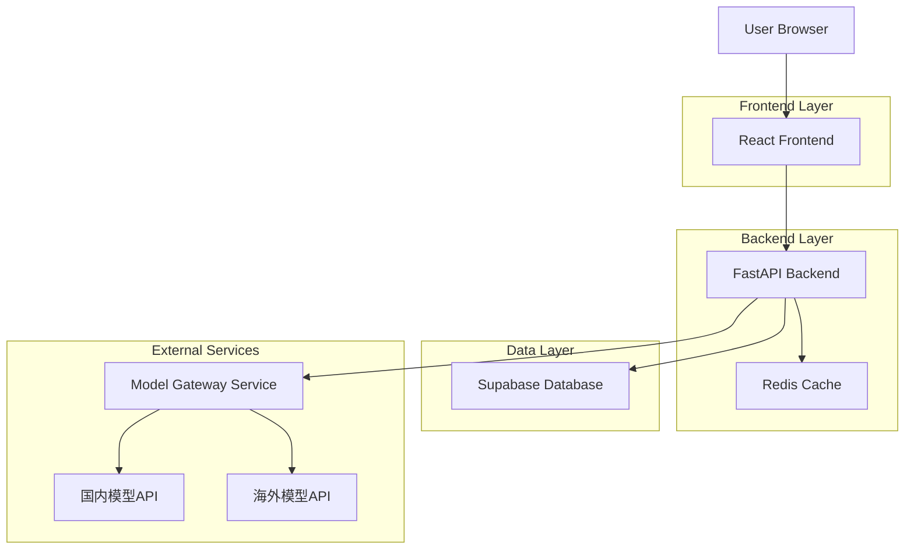
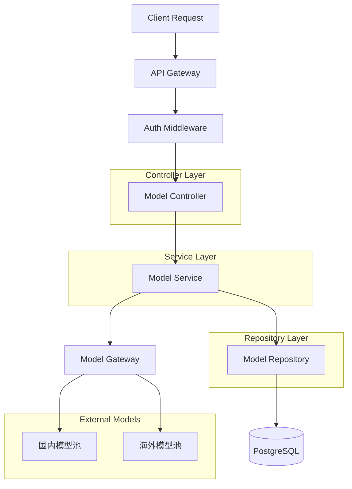
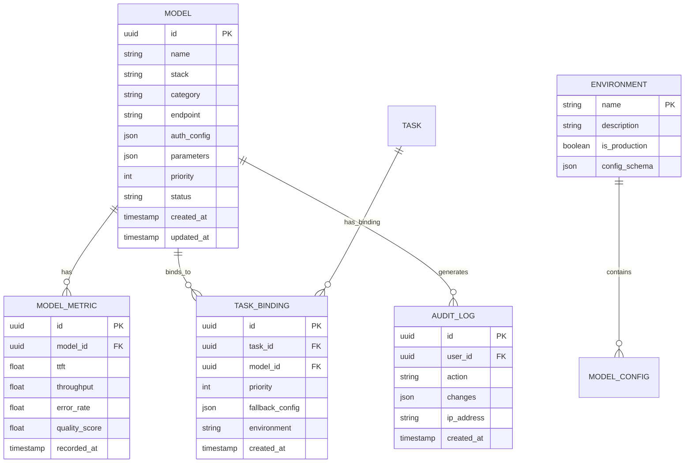

## 1. 架构设计



## 2. 技术栈
- **前端**: React@18 + TypeScript + Ant Design@5 + Vite
- **初始化工具**: vite-init
- **后端**: FastAPI@0.104 + Python@3.11
- **数据库**: Supabase (PostgreSQL@15)
- **缓存**: Redis@7
- **部署**: Docker + Nginx

## 3. 路由定义
| 路由 | 用途 |
|------|------|
| / | 登录页，用户认证入口 |
| /dashboard | 监控仪表页，模型性能总览 |
| /models | 模型配置页，双栈模型管理 |
| /models/:id/edit | 模型编辑页，详细配置 |
| /tasks | 任务绑定页，任务模型映射 |
| /environments | 环境管理页，多环境配置 |
| /audit | 审计日志页，操作记录查询 |
| /api/health | 健康检查接口 |

## 4. API定义

### 4.1 模型管理API

**获取模型列表**
```
GET /api/models
```

Query参数:
| 参数名 | 类型 | 必需 | 描述 |
|--------|------|------|------|
| stack | string | false | 模型栈类型: cn/overseas |
| category | string | false | 模型分类 |
| environment | string | false | 环境: dev/test/prod |

响应:
```json
{
  "code": 200,
  "data": {
    "models": [
      {
        "id": "uuid",
        "name": "DeepSeek-V2",
        "stack": "cn",
        "category": "llm",
        "endpoint": "https://api.deepseek.com",
        "status": "active",
        "metrics": {
          "ttft": 0.8,
          "throughput": 100,
          "error_rate": 0.01
        }
      }
    ],
    "total": 1
  }
}
```

**创建模型配置**
```
POST /api/models
```

请求体:
```json
{
  "name": "DeepSeek-V2",
  "stack": "cn",
  "category": "llm",
  "endpoint": "https://api.deepseek.com",
  "auth_config": {
    "type": "api_key",
    "api_key": "sk-xxx"
  },
  "parameters": {
    "max_tokens": 4096,
    "temperature": 0.7
  },
  "priority": 1,
  "environment": "prod"
}
```

**连接测试**
```
POST /api/models/:id/test
```

响应:
```json
{
  "code": 200,
  "data": {
    "status": "success",
    "latency": 850,
    "ttft": 0.3,
    "error": null
  }
}
```

### 4.2 任务绑定API

**获取任务绑定**
```
GET /api/tasks/:taskId/bindings
```

响应:
```json
{
  "code": 200,
  "data": {
    "task_id": "task-001",
    "task_name": "文档理解",
    "bindings": [
      {
        "model_id": "uuid",
        "model_name": "DeepSeek-V2",
        "priority": 1,
        "fallback_models": ["uuid2", "uuid3"]
      }
    ]
  }
}
```

## 5. 服务端架构



## 6. 数据模型

### 6.1 数据库实体关系



### 6.2 数据定义语言

**模型表 (models)**
```sql
-- 创建模型表
CREATE TABLE models (
    id UUID PRIMARY KEY DEFAULT gen_random_uuid(),
    name VARCHAR(100) NOT NULL,
    stack VARCHAR(20) NOT NULL CHECK (stack IN ('cn', 'overseas')),
    category VARCHAR(50) NOT NULL,
    endpoint VARCHAR(500) NOT NULL,
    auth_config JSONB NOT NULL DEFAULT '{}',
    parameters JSONB NOT NULL DEFAULT '{}',
    priority INTEGER DEFAULT 1,
    status VARCHAR(20) DEFAULT 'active' CHECK (status IN ('active', 'inactive', 'testing')),
    environment VARCHAR(20) DEFAULT 'dev',
    created_at TIMESTAMP WITH TIME ZONE DEFAULT NOW(),
    updated_at TIMESTAMP WITH TIME ZONE DEFAULT NOW()
);

-- 创建索引
CREATE INDEX idx_models_stack ON models(stack);
CREATE INDEX idx_models_category ON models(category);
CREATE INDEX idx_models_status ON models(status);
CREATE INDEX idx_models_environment ON models(environment);
```

**模型指标表 (model_metrics)**
```sql
-- 创建模型指标表
CREATE TABLE model_metrics (
    id UUID PRIMARY KEY DEFAULT gen_random_uuid(),
    model_id UUID REFERENCES models(id) ON DELETE CASCADE,
    ttft FLOAT NOT NULL DEFAULT 0,
    throughput FLOAT NOT NULL DEFAULT 0,
    error_rate FLOAT NOT NULL DEFAULT 0,
    quality_score FLOAT NOT NULL DEFAULT 0,
    recorded_at TIMESTAMP WITH TIME ZONE DEFAULT NOW()
);

-- 创建索引
CREATE INDEX idx_model_metrics_model_id ON model_metrics(model_id);
CREATE INDEX idx_model_metrics_recorded_at ON model_metrics(recorded_at DESC);
```

**任务绑定表 (task_bindings)**
```sql
-- 创建任务绑定表
CREATE TABLE task_bindings (
    id UUID PRIMARY KEY DEFAULT gen_random_uuid(),
    task_id VARCHAR(100) NOT NULL,
    task_name VARCHAR(200) NOT NULL,
    model_id UUID REFERENCES models(id) ON DELETE CASCADE,
    priority INTEGER NOT NULL DEFAULT 1,
    fallback_config JSONB DEFAULT '{}',
    environment VARCHAR(20) DEFAULT 'dev',
    created_at TIMESTAMP WITH TIME ZONE DEFAULT NOW(),
    UNIQUE(task_id, model_id, environment)
);

-- 创建索引
CREATE INDEX idx_task_bindings_task_id ON task_bindings(task_id);
CREATE INDEX idx_task_bindings_model_id ON task_bindings(model_id);
CREATE INDEX idx_task_bindings_environment ON task_bindings(environment);
```

**审计日志表 (audit_logs)**
```sql
-- 创建审计日志表
CREATE TABLE audit_logs (
    id UUID PRIMARY KEY DEFAULT gen_random_uuid(),
    user_id UUID NOT NULL,
    user_name VARCHAR(100) NOT NULL,
    action VARCHAR(100) NOT NULL,
    resource_type VARCHAR(50) NOT NULL,
    resource_id VARCHAR(100),
    changes JSONB DEFAULT '{}',
    ip_address INET,
    user_agent TEXT,
    created_at TIMESTAMP WITH TIME ZONE DEFAULT NOW()
);

-- 创建索引
CREATE INDEX idx_audit_logs_user_id ON audit_logs(user_id);
CREATE INDEX idx_audit_logs_action ON audit_logs(action);
CREATE INDEX idx_audit_logs_created_at ON audit_logs(created_at DESC);
```

## 7. 性能优化策略

### 7.1 缓存策略
- **模型配置缓存**: Redis缓存模型配置，TTL 5分钟
- **指标数据缓存**: 热点指标数据缓存，TTL 1分钟
- **连接池**: 数据库连接池，最大连接数50

### 7.2 监控指标
- **接口响应时间**: P99 < 500ms
- **模型连接成功率**: >99%
- **系统可用性**: >99.9%

## 8. 安全设计

### 8.1 认证授权
- **JWT Token**: 用户认证使用JWT，有效期24小时
- **RBAC权限**: 基于角色的访问控制
- **API限流**: 每分钟最多100次请求

### 8.2 数据安全
- **敏感信息加密**: API密钥等敏感信息AES加密存储
- **审计日志**: 所有配置变更记录审计日志
- **HTTPS**: 全站HTTPS加密传输