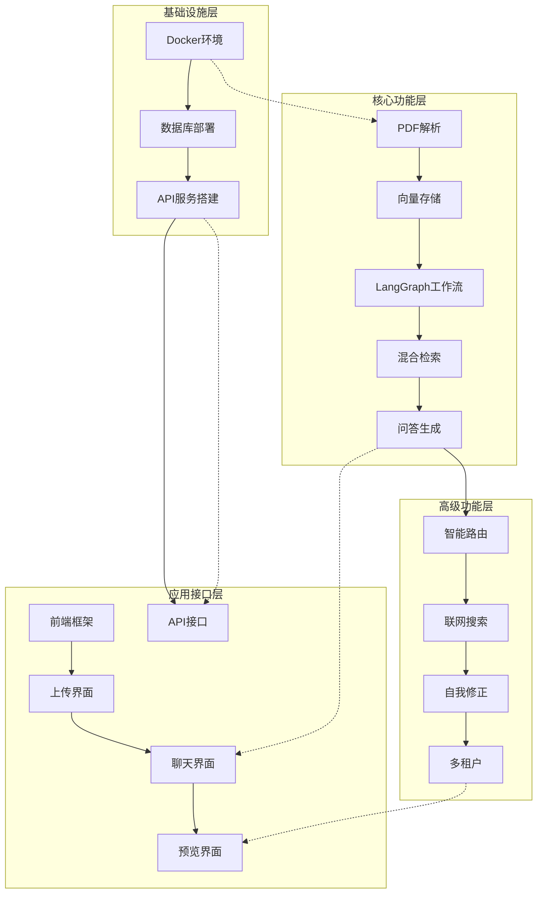

# OmniRAG 开发任务计划

## 1. 项目概述与开发策略

OmniRAG是基于LangGraph架构的下一代智能知识中台，通过视觉驱动的数据解析、自适应混合检索和图导向的智能编排，解决传统RAG系统核心痛点。项目采用MVP+迭代模式，分三个阶段实现从基础功能到完整生态的演进。

**开发核心理念：**

- **价值优先**：优先交付核心视觉解析能力，建立技术护城河
- **架构驱动**：基于ACIS四层架构，确保系统可扩展性
- **质量保障**：严格执行质量门控，确保每个Sprint交付可上线代码
- **风险前置**：技术难点早期验证，降低项目风险

## 2. ACIS分层WBS工作分解

### 2.1 A层 - 应用层 (Application Layer)

```
A1: 用户界面与交互系统
├── A1.1 前端基础架构
│   ├── A1.1.1 React + TypeScript项目搭建
│   ├── A1.1.2 Tailwind CSS样式框架集成
│   └── A1.1.3 状态管理(Zustand)配置
├── A1.2 核心页面开发
│   ├── A1.2.1 文档上传页面
│   ├── A1.2.2 聊天交互页面
│   ├── A1.2.3 文档预览页面
│   └── A1.2.4 系统管理页面
├── A1.3 交互功能
│   ├── A1.3.1 文件拖拽上传
│   ├── A1.3.2 实时聊天流式显示
│   ├── A1.3.3 PDF预览与引用高亮
│   └── A1.3.4 响应式布局适配
└── A1.4 前端集成测试
    ├── A1.4.1 组件单元测试
    ├── A1.4.2 端到端测试
    └── A1.4.3 性能优化

A2: API接口服务
├── A2.1 FastAPI服务框架
│   ├── A2.1.1 项目结构与配置
│   ├── A2.1.2 中间件与异常处理
│   └── A2.1.3 日志与监控集成
├── A2.2 核心API接口
│   ├── A2.2.1 文档上传API
│   ├── A2.2.2 问答交互API
│   ├── A2.2.3 知识库管理API
│   └── A2.2.4 系统配置API
├── A2.3 LangServe集成
│   ├── A2.3.1 LangGraph工作流部署
│   ├── A2.3.2 SSE流式响应
│   └── A2.3.3 API文档生成
└── A2.4 接口测试与文档
    ├── A2.4.1 API自动化测试
    ├── A2.4.2 OpenAPI文档
    └── A2.4.3 SDK代码生成

A3: 可视化展示系统
├── A3.1 数据可视化
│   ├── A3.1.1 解析进度展示
│   ├── A3.1.2 检索结果可视化
│   └── A3.1.3 性能指标图表
├── A3.2 运营管理后台
│   ├── A3.2.1 用户行为分析
│   ├── A3.2.2 系统性能监控
│   └── A3.2.3 运营数据统计
└── A3.3 多主题支持
    ├── A3.3.1 主题切换功能
    └── A3.3.2 自定义品牌配置
```

### 2.2 C层 - 核心层 (Core Layer)

```
C1: LangGraph工作流引擎
├── C1.1 状态管理设计
│   ├── C1.1.1 AgentState TypedDict定义
│   ├── C1.1.2 状态持久化配置
│   └── C1.1.3 状态验证与转换
├── C1.2 基础节点实现
│   ├── C1.2.1 retrieve节点(文档检索)
│   ├── C1.2.2 generate节点(答案生成)
│   └── C1.2.3 错误处理节点
├── C1.3 条件路由实现
│   ├── C1.3.1 文档相关性判断
│   ├── C1.3.2 路由决策逻辑
│   └── C1.3.3 条件边配置
├── C1.4 高级节点功能
│   ├── C1.4.1 grade_documents(文档评分)
│   ├── C1.4.2 web_search(联网搜索)
│   ├── C1.4.3 hallucination_check(幻觉检测)
│   └── C1.4.4 self_correction(自我修正)
└── C1.5 工作流测试
    ├── C1.5.1 单元测试覆盖
    ├── C1.5.2 集成测试验证
    └── C1.5.3 性能基准测试

C2: 视觉PDF处理模块
├── C2.1 文档解析引擎
│   ├── C2.1.1 PDF转图片渲染
│   ├── C2.1.2 版面分析检测
│   └── C2.1.3 内容提取优化
├── C2.2 视觉模型集成
│   ├── C2.2.1 Gemini 3 Vision配置
│   ├── C2.2.2 表格识别Prompt设计
│   └── C2.2.3 图片理解Caption生成
├── C2.3 表格处理专项
│   ├── C2.3.1 表格区域检测
│   ├── C2.3.2 表格结构还原
│   └── C2.3.3 Markdown格式转换
├── C2.4 多模态支持
│   ├── C2.4.1 DOCX格式支持
│   ├── C2.4.2 PPTX格式支持
│   └── C2.4.3 图片格式支持
├── C2.5 解析策略优化
│   ├── C2.5.1 ParsingRule开关设计
│   ├── C2.5.2 OCR与Vision智能选择
│   └── C2.5.3 批处理与缓存机制
└── C2.6 解析质量保障
    ├── C2.6.1 准确率测试集
    ├── C2.6.2 性能基准测试
    └── C2.6.3 异常处理完善

C3: 文档检索与问答
├── C3.1 向量存储集成
│   ├── C3.1.1 Milvus数据库配置
│   ├── C3.1.2 向量索引优化
│   └── C3.1.3 集合管理策略
├── C3.2 混合检索实现
│   ├── C3.2.1 向量检索(语义搜索)
│   ├── C3.2.2 关键词检索(BM25)
│   └── C3.2.3 结果融合算法
├── C3.3 重排序机制
│   ├── C3.3.1 BGE-Reranker集成
│   ├── C3.3.2 多阶段排序策略
│   └── C3.3.3 Top-K结果优化
├── C3.4 问答生成优化
│   ├── C3.4.1 Prompt工程优化
│   ├── C3.4.2 上下文组装策略
│   └── C3.4.3 答案质量评估
├── C3.5 引用溯源实现
│   ├── C3.5.1 引用标记生成
│   ├── C3.5.2 PDF坐标记录
│   └── C3.5.3 高亮定位功能
└── C3.6 检索性能调优
    ├── C3.6.1 查询延迟优化
    ├── C3.6.2 缓存策略设计
    └── C3.6.3 并发处理优化
```

### 2.3 I层 - 基础设施层 (Infrastructure Layer)

```
I1: Milvus向量数据库
├── I1.1 集群部署
│   ├── I1.1.1 Docker容器化部署
│   ├── I1.1.2 Kubernetes配置
│   └── I1.1.3 高可用架构设计
├── I1.2 数据模型设计
│   ├── I1.2.1 Collection结构设计
│   ├── I1.2.2 向量字段定义
│   └── I1.2.3 元数据索引配置
├── I1.3 性能调优
│   ├── I1.3.1 索引算法选择
│   ├── I1.3.2 查询参数优化
│   └── I1.3.3 内存管理策略
├── I1.4 监控与运维
│   ├── I1.4.1 性能指标监控
│   ├── I1.4.2 告警规则配置
│   └── I1.4.3 备份恢复策略
└── I1.5 扩展性设计
    ├── I1.5.1 分片策略设计
    └── I1.5.2 负载均衡配置

I2: PostgreSQL检查点存储
├── I2.1 数据库设计
│   ├── I2.1.1 检查点表结构
│   ├── I2.1.2 状态历史记录
│   └── I2.1.3 索引优化配置
├── I2.2 LangGraph集成
│   ├── I2.2.1 PostgresSaver配置
│   ├── I2.2.2 异步存储实现
│   └── I2.2.3 状态恢复机制
├── I2.3 数据一致性
│   ├── I2.3.1 事务处理策略
│   ├── I2.3.2 并发控制机制
│   └── I2.3.3 数据完整性保障
└── I2.4 运维管理
    ├── I2.4.1 备份策略制定
    ├── I2.4.2 性能监控配置
    └── I2.4.3 故障恢复流程

I3: FastAPI服务框架
├── I3.1 服务架构设计
│   ├── I3.1.1 分层架构定义
│   ├── I3.1.2 依赖注入配置
│   └── I3.1.3 中间件链路设计
├── I3.2 安全性配置
│   ├── I3.2.1 JWT认证集成
│   ├── I3.2.2 RBAC权限控制
│   └── I3.2.3 API限流防护
├── I3.3 性能优化
│   ├── I3.3.1 异步处理机制
│   ├── I3.3.2 连接池管理
│   └── I3.3.3 响应缓存策略
└── I3.4 服务治理
    ├── I3.4.1 健康检查接口
    ├── I3.4.2 服务指标监控
    └── I3.4.3 日志聚合分析
```

### 2.4 S层 - 支撑层 (Support Layer)

```
S1: 监控与日志系统
├── S1.1 应用性能监控
│   ├── S1.1.1 APM工具集成
│   ├── S1.1.2 自定义指标采集
│   └── S1.1.3 性能瓶颈分析
├── S1.2 日志管理
│   ├── S1.2.1 结构化日志设计
│   ├── S1.2.2 日志聚合收集
│   └── S1.2.3 日志分析告警
├── S1.3 链路追踪
│   ├── S1.3.1 分布式追踪实现
│   ├── S1.3.2 调用链分析
│   └── S1.3.3 性能优化建议
└── S1.4 监控告警
    ├── S1.4.1 告警规则设计
    ├── S1.4.2 通知渠道配置
    └── S1.4.3 告警收敛策略

S2: 测试与质量保证
├── S2.1 自动化测试框架
│   ├── S2.1.1 单元测试体系
│   ├── S2.1.2 集成测试框架
│   └── S2.1.3 端到端测试
├── S2.2 性能测试
│   ├── S2.2.1 负载测试方案
│   ├── S2.2.2 压力测试执行
│   └── S2.2.3 性能基准建立
├── S2.3 安全测试
│   ├── S2.3.1 安全扫描集成
│   ├── S2.3.2 渗透测试执行
│   └── S2.3.3 漏洞修复验证
└── S2.4 质量门禁
    ├── S2.4.1 代码质量检查
    ├── S2.4.2 测试覆盖率要求
    └── S2.4.3 发布质量标准

S3: 部署与运维
├── S3.1 容器化部署
│   ├── S3.1.1 Docker镜像构建
│   ├── S3.1.2 Kubernetes配置
│   └── S3.1.3 Helm Chart开发
├── S3.2 CI/CD流水线
│   ├── S3.2.1 代码集成流程
│   ├── S3.2.2 自动化部署
│   └── S3.2.3 回滚机制设计
├── S3.3 环境管理
│   ├── S3.3.1 多环境配置
│   ├── S3.3.2 配置管理策略
│   └── S3.3.3 密钥安全管理
└── S3.4 运维自动化
    ├── S3.4.1 运维脚本开发
    ├── S3.4.2 故障自愈机制
    └── S3.4.3 容量规划工具
```

## 3. Sprint迭代规划（2周/Sprint）

### 3.1 MVP阶段 - Sprint 1-4 (8周)

#### Sprint 1: 基础架构搭建 (Week 1-2)

**目标**: 完成项目基础架构和开发环境搭建
**交付物**: 可运行的基础框架

| 任务ID | 任务描述             | 优先级 | 估算(人天) | 依赖   | 验收标准        | DRI      |
| ------ | -------------------- | ------ | ---------- | ------ | --------------- | -------- |
| S3.1.1 | Docker开发环境配置   | P0     | 2          | -      | 容器正常启动    | DevOps   |
| I1.1.1 | Milvus容器化部署     | P0     | 2          | S3.1.1 | 数据库连接正常  | 架构师   |
| I2.1.1 | PostgreSQL表结构设计 | P0     | 3          | -      | 表结构评审通过  | 后端开发 |
| I3.1.1 | FastAPI项目框架搭建  | P0     | 3          | -      | API服务启动正常 | 后端开发 |
| A1.1.1 | React前端项目初始化  | P0     | 2          | -      | 开发服务器正常  | 前端开发 |
| S2.1.1 | 测试框架配置         | P1     | 2          | -      | 测试用例可执行  | QA       |

**Sprint目标达成标准**:

- ✅ 所有P0任务完成
- ✅ 开发环境可正常使用
- ✅ 代码仓库结构清晰
- ✅ CI/CD基础流程跑通

#### Sprint 2: 视觉解析核心 (Week 3-4)

**目标**: 完成视觉PDF解析核心功能
**交付物**: 可解析PDF的基础版本

| 任务ID | 任务描述              | 优先级 | 估算(人天) | 依赖          | 验收标准     | DRI        |
| ------ | --------------------- | ------ | ---------- | ------------- | ------------ | ---------- |
| C2.1.1 | PDF转图片渲染引擎     | P0     | 4          | Sprint1       | 转换质量达标 | 算法工程师 |
| C2.2.1 | Gemini Vision模型集成 | P0     | 3          | Sprint1       | API调用正常  | 算法工程师 |
| C2.3.1 | 表格识别与还原        | P0     | 5          | C2.1.1,C2.2.1 | 准确率≥90%   | 算法工程师 |
| C2.5.1 | ParsingRule开关设计   | P1     | 2          | C2.2.1        | 策略可配置   | 后端开发   |
| C2.6.1 | 解析质量测试集        | P1     | 3          | C2.3.1        | 测试用例完整 | QA         |
| A2.2.1 | 文档上传API           | P0     | 2          | Sprint1       | 接口测试通过 | 后端开发   |

**Sprint目标达成标准**:

- ✅ PDF解析功能可用
- ✅ 表格识别准确率≥90%
- ✅ 基础API接口稳定
- ✅ 测试覆盖率达到80%

#### Sprint 3: LangGraph工作流 (Week 5-6)

**目标**: 完成LangGraph基础工作流实现
**交付物**: 可运行的RAG工作流

| 任务ID | 任务描述           | 优先级 | 估算(人天) | 依赖          | 验收标准         | DRI        |
| ------ | ------------------ | ------ | ---------- | ------------- | ---------------- | ---------- |
| C1.1.1 | AgentState状态设计 | P0     | 3          | Sprint1       | 状态结构评审通过 | 架构师     |
| C1.2.1 | retrieve节点实现   | P0     | 3          | C1.1.1        | 检索功能正常     | 后端开发   |
| C1.2.2 | generate节点实现   | P0     | 3          | C1.1.1        | 生成功能正常     | 后端开发   |
| C3.1.1 | Milvus向量存储集成 | P0     | 4          | Sprint1       | 向量存储正常     | 后端开发   |
| C3.2.1 | 混合检索实现       | P0     | 3          | C3.1.1        | 检索效果达标     | 算法工程师 |
| A2.3.1 | LangServe服务部署  | P0     | 2          | C1.2.1,C1.2.2 | SSE流正常        | 后端开发   |

**Sprint目标达成标准**:

- ✅ LangGraph工作流可运行
- ✅ 向量检索功能集成
- ✅ 基础问答功能可用
- ✅ API服务稳定提供

#### Sprint 4: 前端集成与优化 (Week 7-8)

**目标**: 完成前端基础功能集成
**交付物**: 可用的Web界面

| 任务ID | 任务描述     | 优先级 | 估算(人天) | 依赖    | 验收标准     | DRI      |
| ------ | ------------ | ------ | ---------- | ------- | ------------ | -------- |
| A1.2.1 | 文档上传页面 | P0     | 3          | A2.2.1  | 上传功能完整 | 前端开发 |
| A1.2.2 | 聊天交互页面 | P0     | 4          | A2.3.1  | 流式显示正常 | 前端开发 |
| A1.2.3 | 文档预览页面 | P0     | 3          | C2.3.1  | PDF预览正常  | 前端开发 |
| A1.3.1 | 文件拖拽上传 | P1     | 2          | A1.2.1  | 交互体验良好 | 前端开发 |
| C3.5.1 | 引用溯源实现 | P1     | 3          | Sprint3 | 引用定位准确 | 后端开发 |
| S2.1.1 | 端到端测试   | P1     | 3          | A1.2.2  | 测试用例通过 | QA       |

**MVP完成标准**:

- ✅ 用户可上传PDF文档
- ✅ 系统可解析并建立索引
- ✅ 用户可通过界面进行问答
- ✅ 答案可追溯到原文
- ✅ 基础性能指标达标

### 3.2 Phase 2阶段 - Sprint 5-7 (6周)

#### Sprint 5: 智能路由与联网搜索 (Week 9-10)

**目标**: 实现意图识别和联网搜索功能
**交付物**: 智能问答系统v2

| 任务ID | 任务描述            | 优先级 | 估算(人天) | 依赖          | 验收标准       | DRI        |
| ------ | ------------------- | ------ | ---------- | ------------- | -------------- | ---------- |
| C1.4.1 | grade_documents节点 | P0     | 4          | Sprint3       | 评分准确率≥85% | 算法工程师 |
| C1.4.2 | web_search节点      | P0     | 3          | Sprint3       | 搜索功能正常   | 后端开发   |
| C1.3.1 | 条件路由实现        | P0     | 3          | C1.4.1,C1.4.2 | 路由逻辑正确   | 架构师     |
| C3.3.1 | BGE-Reranker集成    | P0     | 3          | Sprint3       | 重排序效果提升 | 算法工程师 |
| A2.2.2 | 知识库管理API       | P1     | 2          | Sprint1       | 管理功能完整   | 后端开发   |
| S1.1.1 | 应用监控集成        | P1     | 2          | Sprint1       | 监控数据正常   | DevOps     |

#### Sprint 6: 管理后台与自我修正 (Week 11-12)

**目标**: 完善管理功能和自我修正机制
**交付物**: 企业级管理系统

| 任务ID | 任务描述                | 优先级 | 估算(人天) | 依赖    | 验收标准           | DRI        |
| ------ | ----------------------- | ------ | ---------- | ------- | ------------------ | ---------- |
| C1.4.3 | hallucination_check节点 | P0     | 4          | C1.4.1  | 幻觉检测准确率≥90% | 算法工程师 |
| C1.4.4 | self_correction节点     | P0     | 3          | C1.4.3  | 修正效果提升       | 算法工程师 |
| A1.2.4 | 系统管理页面            | P0     | 4          | A2.2.2  | 管理功能完整       | 前端开发   |
| A3.2.1 | 运营分析功能            | P1     | 3          | A1.2.4  | 分析数据准确       | 前端开发   |
| I3.2.1 | 安全认证集成            | P1     | 3          | Sprint1 | 认证功能正常       | 后端开发   |
| S2.3.1 | 安全扫描集成            | P1     | 2          | I3.2.1  | 无高危漏洞         | QA         |

##### 增补：模型网关与多模态/Embed接入（Week 11-12 并行）

**目标**: 提供国内/国外/本地模型接入与任务模型绑定，完成连接测试与密钥管理。
**交付物**: 模型网关配置界面 + 提供商适配层 + 验证与限流机制

| 任务ID  | 任务描述                                           | 优先级 | 估算(人天) | 依赖   | 验收标准             | DRI        |
| ------- | -------------------------------------------------- | ------ | ---------- | ------ | -------------------- | ---------- |
| A2.2.4  | 系统配置API（模型网关）                            | P0     | 3          | I3.1.1 | OpenAPI文档完整      | 后端开发   |
| A1.2.4b | 模型网关配置界面（国内/国外/本地Tab）              | P0     | 4          | A1.2.4 | 连接测试成功率≥99%   | 前端开发   |
| I3.1.4  | 提供商适配层（OpenAI/Anthropic/Gemini/OpenRouter） | P0     | 4          | I3.1.1 | 生成TTFT≤800ms       | 后端开发   |
| I3.1.5  | 国内提供商适配（通义/Kimi/千帆/智谱/DeepSeek）     | P0     | 6          | I3.1.1 | 网络适配与重试完整   | 后端开发   |
| I3.1.6  | 本地模型适配（Ollama）                             | P1     | 3          | I3.1.1 | 模型列表与限流可用   | 后端开发   |
| C2.2.4  | Vision解析模型绑定                                 | P1     | 3          | C2.2.1 | 解析速度≤3秒/页      | 算法工程师 |
| C3.3.4  | Embedding/Rerank模型绑定                           | P1     | 3          | C3.3.1 | 检索≤100ms           | 算法工程师 |
| S2.4.4  | 密钥加密与审计、配额限流                           | P0     | 3          | I3.2.1 | 无明文密钥、限流有效 | DevOps     |

#### Sprint 7: 性能优化与多格式支持 (Week 13-14)

**目标**: 支持更多文档格式，优化系统性能
**交付物**: 多模态文档处理系统

| 任务ID | 任务描述            | 优先级 | 估算(人天) | 依赖    | 验收标准       | DRI        |
| ------ | ------------------- | ------ | ---------- | ------- | -------------- | ---------- |
| C2.4.1 | DOCX格式支持        | P0     | 3          | C2.1.1  | 解析功能正常   | 算法工程师 |
| C2.4.2 | PPTX格式支持        | P0     | 3          | C2.1.1  | 解析功能正常   | 算法工程师 |
| C2.5.2 | OCR与Vision智能选择 | P1     | 3          | C2.5.1  | 选择策略有效   | 算法工程师 |
| C3.6.1 | 检索性能优化        | P1     | 3          | Sprint3 | 查询延迟≤100ms | 后端开发   |
| S3.1.1 | Docker生产部署      | P1     | 3          | Sprint1 | 容器化部署成功 | DevOps     |
| S2.2.1 | 压力测试执行        | P1     | 2          | C3.6.1  | 支持100QPS     | QA         |

### 3.3 Phase 3阶段 - Sprint 8-10 (6周)

#### Sprint 8: API生态与多租户 (Week 15-16)

**目标**: 构建完整API生态和多租户架构
**交付物**: 企业级开放平台

| 任务ID | 任务描述        | 优先级 | 估算(人天) | 依赖    | 验收标准        | DRI      |
| ------ | --------------- | ------ | ---------- | ------- | --------------- | -------- |
| A2.4.2 | OpenAPI完整文档 | P0     | 3          | Sprint2 | 文档覆盖率100%  | 后端开发 |
| A2.4.3 | SDK代码生成     | P0     | 2          | A2.4.2  | SDK功能完整     | 后端开发 |
| I3.2.2 | RBAC权限控制    | P0     | 4          | I3.2.1  | 权限粒度≤记录级 | 后端开发 |
| A3.1.1 | 数据可视化功能  | P1     | 3          | A1.2.4  | 图表展示正常    | 前端开发 |
| S3.2.1 | CI/CD流水线     | P1     | 3          | S3.1.1  | 自动化部署成功  | DevOps   |
| A1.4.1 | 前端性能优化    | P1     | 2          | Sprint4 | 页面加载≤2秒    | 前端开发 |

#### Sprint 9: 嵌入集成与插件系统 (Week 17-18)

**目标**: 实现JS嵌入和插件扩展能力
**交付物**: 完整生态集成方案

| 任务ID | 任务描述     | 优先级 | 估算(人天) | 依赖    | 验收标准     | DRI        |
| ------ | ------------ | ------ | ---------- | ------- | ------------ | ---------- |
| A2.2.3 | 嵌入API开发  | P0     | 3          | A2.4.2  | 嵌入功能正常 | 后端开发   |
| A1.1.2 | JS SDK开发   | P0     | 4          | A2.2.3  | 一行代码嵌入 | 前端开发   |
| C1.5.1 | 插件系统设计 | P1     | 4          | Sprint3 | 扩展点≥10个  | 架构师     |
| A3.3.1 | 主题切换功能 | P1     | 2          | A1.2.4  | 主题切换正常 | 前端开发   |
| S1.2.1 | 日志聚合系统 | P1     | 3          | Sprint1 | 日志收集完整 | DevOps     |
| C2.4.3 | 图片格式支持 | P1     | 2          | C2.1.1  | 图片解析正常 | 算法工程师 |

#### Sprint 10: 最终优化与发布准备 (Week 19-20)

**目标**: 系统最终优化，准备正式发布
**交付物**: GA版本发布

| 任务ID | 任务描述     | 优先级 | 估算(人天) | 依赖       | 验收标准       | DRI      |
| ------ | ------------ | ------ | ---------- | ---------- | -------------- | -------- |
| S2.4.1 | 最终质量检查 | P0     | 3          | 所有Sprint | 所有质量门通过 | QA       |
| S3.3.1 | 生产环境部署 | P0     | 4          | S3.2.1     | 生产环境稳定   | DevOps   |
| A3.2.2 | 完整运营后台 | P1     | 3          | A3.1.1     | 运营功能完整   | 前端开发 |
| S1.3.1 | 链路追踪完善 | P1     | 2          | Sprint1    | 调用链完整     | DevOps   |
| S2.2.1 | 最终性能测试 | P1     | 2          | Sprint7    | 性能指标达标   | QA       |
| S3.4.1 | 运维自动化   | P1     | 3          | S3.3.1     | 运维脚本完备   | DevOps   |

## 4. 任务依赖关系图



## 5. 质量门控与验收标准

### 5.1 质量门定义

**G1 - 代码质量门 (每个Sprint)**

- 代码覆盖率 ≥ 90%
- 静态代码分析无严重问题
- 代码审查通过率 100%
- 技术债务评估通过

**G2 - 功能质量门 (每个Phase)**

- 所有P0特性功能完整
- 功能测试通过率 ≥ 95%
- 无阻塞性缺陷
- 用户验收测试通过

**G3 - 性能质量门 (Phase 2开始)**

- 响应时间 ≤ 1秒 (TTFT ≤ 500ms)
- 并发处理 ≥ 100 QPS
- 资源使用率合理 (CPU ≤ 70%, 内存 ≤ 2GB)
- 压力测试通过

**G4 - 安全质量门 (发布前)**

- 安全扫描无高危漏洞
- 渗透测试通过
- 数据保护合规 (PII检出率 ≥ 99%)
- 权限控制验证

### 5.2 Definition of Done (DoD)

**特性完成标准**:

- [ ] 代码实现完成并通过Code Review
- [ ] 单元测试编写完成，覆盖率 ≥ 90%
- [ ] 集成测试通过，无回归问题
- [ ] 性能指标达标，通过性能测试
- [ ] 安全扫描无高危问题
- [ ] 文档更新完整（API文档、部署文档）
- [ ] 通过QA验收测试

**Sprint完成标准**:

- [ ] 所有P0任务完成DoD
- [ ] Sprint目标达成
- [ ] 无未解决的阻塞性问题
- [ ] 下一个Sprint计划就绪

**发布就绪标准**:

- [ ] 所有质量门通过
- [ ] 回归测试通过
- [ ] 性能基准测试完成
- [ ] 安全评估报告
- [ ] 用户验收测试通过
- [ ] 部署文档和运维手册完备
- [ ] 回滚方案准备就绪

## 6. 风险识别与缓解策略

### 6.1 技术风险

| 风险描述                    | 概率 | 影响 | 缓解措施                      | 负责人     | 监控指标       |
| --------------------------- | ---- | ---- | ----------------------------- | ---------- | -------------- |
| Gemini Vision Token消耗过高 | 高   | 高   | 实现智能切换策略，默认使用OCR | 架构师     | Token使用量/页 |
| Milvus性能瓶颈              | 中   | 高   | 优化索引参数，准备集群方案    | 运维团队   | 查询延迟       |
| LangGraph状态管理复杂       | 中   | 中   | 增加状态设计评审，完善文档    | 技术负责人 | 状态流转错误率 |
| 多模态解析准确率不达标      | 高   | 高   | 建立人工标注流程，持续优化    | 算法工程师 | 解析准确率     |
| 前端性能优化困难            | 低   | 中   | 使用性能分析工具，渐进优化    | 前端开发   | 页面加载时间   |

### 6.2 项目风险

| 风险描述           | 概率 | 影响 | 缓解措施                       | 负责人   |
| ------------------ | ---- | ---- | ------------------------------ | -------- |
| 关键开发人员流失   | 中   | 高   | 知识文档化，代码审查，交叉培训 | 项目经理 |
| 需求频繁变更       | 高   | 中   | 严格的变更控制流程，影响评估   | 产品经理 |
| 第三方服务依赖风险 | 中   | 中   | 多供应商方案，降级策略         | 架构师   |
| 测试环境不稳定     | 低   | 中   | 容器化测试环境，自动化重建     | DevOps   |

### 6.3 业务风险

| 风险描述         | 概率 | 影响 | 缓解措施                     | 负责人     |
| ---------------- | ---- | ---- | ---------------------------- | ---------- |
| 市场竞争加剧     | 高   | 高   | 强化视觉解析差异化优势       | 产品经理   |
| 企业客户接受度低 | 中   | 高   | 提供免费试用，建立标杆案例   | 销售负责人 |
| 数据安全合规要求 | 中   | 高   | 提供私有化部署，完善安全机制 | 安全负责人 |

## 7. RACI职责矩阵

### 7.1 核心角色定义

- **产品经理 (PM)**: 需求定义，优先级排序，验收确认
- **技术负责人 (Tech Lead)**: 架构设计，技术决策，代码审查
- **开发工程师 (Dev)**: 功能实现，单元测试，文档编写
- **QA工程师 (QA)**: 测试用例设计，质量验证，缺陷跟踪
- **DevOps工程师 (DevOps)**: 环境搭建，部署发布，监控配置
- **算法工程师 (Algo)**: 模型集成，算法优化，效果调优

### 7.2 Sprint任务RACI矩阵

| 任务类型     | PM  | Tech Lead | Dev | QA  | DevOps | Algo |
| ------------ | --- | --------- | --- | --- | ------ | ---- |
| **需求分析** | A   | C         | I   | C   | I      | I    |
| **架构设计** | C   | A         | C   | I   | C      | C    |
| **功能开发** | I   | C         | A   | C   | I      | C    |
| **模型集成** | I   | C         | C   | C   | I      | A    |
| **代码审查** | I   | A         | R   | C   | I      | C    |
| **测试执行** | I   | C         | C   | A   | I      | C    |
| **性能优化** | I   | A         | C   | C   | C      | C    |
| **部署发布** | C   | C         | C   | C   | A      | I    |
| **监控运维** | I   | I         | I   | C   | A      | I    |

**RACI定义**:

- A=Accountable (负责) - 最终责任人
- R=Responsible (执行) - 具体执行人
- C=Consulted (协商) - 需要咨询的人
- I=Informed (知情) - 需要被告知的人

## 8. 交付物清单与发布节奏

### 8.1 阶段性交付物

**MVP阶段交付物**:

- ✅ 视觉PDF解析器 (准确率≥90%)
- ✅ 基础LangGraph工作流
- ✅ 向量检索系统
- ✅ Web聊天界面
- ✅ 基础API接口
- ✅ 容器化部署方案

**Phase 2交付物**:

- ✅ 智能意图路由
- ✅ 联网搜索能力
- ✅ 自我修正机制
- ✅ 管理后台系统
- ✅ 运营分析功能
- ✅ 安全认证体系

**Phase 3交付物**:

- ✅ 完整OpenAPI规范
- ✅ JavaScript SDK
- ✅ 多租户架构
- ✅ 插件系统
- ✅ 数据可视化
- ✅ 企业级运维工具

### 8.2 发布节奏规划

| 发布类型       | 频率   | 目标环境   | 主要用途 | 质量要求           |
| -------------- | ------ | ---------- | -------- | ------------------ |
| **每日构建**   | 每日   | 开发环境   | 快速验证 | 编译通过，基础测试 |
| **Sprint发布** | 每2周  | 测试环境   | 功能验证 | 功能测试通过       |
| **月度发布**   | 每月   | 预生产环境 | 集成测试 | 所有质量门通过     |
| **里程碑发布** | 每阶段 | 生产环境   | 正式发布 | 完全生产就绪       |

### 8.3 版本命名规范

- **开发版本**: `v0.x.y-dev.{build}` (如: v0.1.0-dev.123)
- **测试版本**: `v0.x.y-rc.{number}` (如: v0.1.0-rc.1)
- **正式版本**: `v{x}.{y}.{z}` (如: v1.0.0)
- **热修复版本**: `v{x}.{y}.{z}-hotfix.{number}` (如: v1.0.1-hotfix.1)

## 9. 监控度量与KPI体系

### 9.1 开发效率指标

| KPI指标         | 目标值    | 监控频率 | 责任人       |
| --------------- | --------- | -------- | ------------ |
| Sprint完成率    | ≥90%      | 每Sprint | Scrum Master |
| 代码提交频率    | ≥5次/人天 | 每日     | 技术负责人   |
| Code Review时效 | ≤4小时    | 每日     | 开发团队     |
| 缺陷修复时间    | ≤8小时    | 实时     | 开发团队     |
| 构建成功率      | ≥95%      | 每次构建 | DevOps       |

### 9.2 质量指标

| KPI指标    | 目标值    | 监控频率 | 责任人     |
| ---------- | --------- | -------- | ---------- |
| 代码覆盖率 | ≥90%      | 每次提交 | QA团队     |
| 缺陷密度   | ≤0.5/KLOC | 每周     | QA团队     |
| 安全漏洞数 | 0个高危   | 每次扫描 | 安全负责人 |
| 性能回归   | 0次       | 每次发布 | 性能团队   |
| 文档完整性 | 100%      | 每次发布 | 技术负责人 |

### 9.3 业务价值指标

| KPI指标      | 目标值        | 监控频率 | 责任人     |
| ------------ | ------------- | -------- | ---------- |
| 功能交付率   | 100% (P0特性) | 每阶段   | 产品经理   |
| 用户故事完成 | ≥95%          | 每Sprint | 产品经理   |
| 技术债务控制 | ≤5%           | 每月     | 技术负责人 |
| 客户满意度   | ≥4.5/5.0      | 每季度   | 项目经理   |

## 10. 沟通协作机制

### 10.1 日常沟通

**每日站会** (15分钟)

- 时间: 上午9:30
- 参与: 核心开发团队
- 内容: 进展同步，阻塞问题识别

**技术讨论** (按需)

- 触发: 技术难点或架构决策
- 参与: 相关技术人员
- 输出: 技术方案文档

### 10.2 周期性会议

**Sprint计划会议** (2小时)

- 时间: 每Sprint第一天
- 内容: 任务分解，工作量评估
- 输出: Sprint计划和任务分配

**Sprint回顾会议** (1小时)

- 时间: 每Sprint最后一天
- 内容: 回顾总结，改进建议
- 输出: 改进行动计划

**月度评审会议** (2小时)

- 时间: 每月最后一个周五
- 参与: 项目组全员
- 内容: 质量指标评审，风险回顾

### 10.3 文档与报告

**Sprint报告** (每周)

- 进展: 完成任务百分比
- 质量: 测试通过率，缺陷统计
- 风险: 识别的风险和缓解措施

**里程碑报告** (每阶段)

- 全面回顾: 目标达成情况
- 质量分析: 各维度质量指标
- 经验总结: 成功经验和改进建议

**项目仪表盘** (实时)

- 构建状态，测试覆盖率
- 性能指标，安全扫描结果
- 部署状态，监控告警

---

**文档维护说明**:

- 本文档每月评审更新
- 重大变更需技术负责人审批
- 版本历史记录在Git中维护
- 访问权限: 项目组成员均可访问

**最后更新**: 2024-01-15
**下次评审**: 2024-02-15
**文档负责人**: 技术负责人
**审批人**: 项目经理

## 开发进度更新（截至 2025-11-30）

- 流式编排与事件契约：`/chat/stream` 改为使用 LangGraph `astream`，SSE 事件标准化为 `metadata/thought/citation/message`，各节点返回 `metrics`（计时、数量、分数等）。
- 检索与重排：上线 RRF 融合（k=60），接入 `BAAI/bge-reranker-v2-m3` 并启用低分过滤与 Top-K 截取。
- 视觉解析与网关：VisualPDFLoader 统一走 ModelGateway 视觉接口；ParsingRule 触发策略细化（短行比例/标点密度等）。
- 联网搜索与自我修正：DuckDuckGo Provider 工具化；`grade_documents` 与 `hallucination_check` 节点可用，输出一致性数值与阈值判定。
- 基准验证：新增 `scripts/benchmark_rag.py` 验证 `astream` 与节点指标，便于 TTFT/阶段耗时采集。

### 进度统计（映射 Backlog 特性）

| 特性ID | 状态   | 说明                                                              |
| ------ | ------ | ----------------------------------------------------------------- |
| F-001  | 完成   | 视觉PDF加载器实现；视觉接口网关化，表格识别与 Markdown 输出       |
| F-002  | 完成   | LangGraph 基础工作流；路由/检索/重排/生成/自检串联                |
| F-003  | 完成   | 向量存储与检索；Milvus 集成与本地回退；RRF 融合上线               |
| F-004  | 完成   | FastAPI 服务接口；上传/预览/SSE 流式；模型配置 API                |
| F-011  | 进行中 | 模型网关配置界面；后端 API 就绪，前端界面待开发                   |
| F-012  | 进行中 | 国外提供商适配：Gemini/OpenRouter 已连通；OpenAI/Anthropic 待配置 |
| F-013  | 待启动 | 国内提供商适配：通义/Kimi/千帆/智谱/DeepSeek                      |
| F-014  | 待启动 | 本地模型适配：Ollama                                              |
| F-015  | 进行中 | 多模态解析绑定：视觉接口已接入，分任务绑定待界面                  |
| F-016  | 进行中 | Embed/Rerank 绑定：Rerank 已接入；Embedding 维度与归一化待绑定    |
| F-017  | 进行中 | 密钥与配额管理：API 与后端校验在建；UI 与审计待接                 |

### 下一步优先事项执行计划跟踪

- 节点事件标准化与指标可视化：已完成节点返回 `metrics`，前端展示与联调进行中。
- 模型网关配置与连接测试闭环：后端接口完成；前端页与分环境密钥/配额/审计落地中。
- 视觉解析策略细化：已细化触发策略；后续增加版面复杂度得分与日志采集。
- 端到端基准：基准脚本已添加；补充检索准确率与幻觉率评估脚本以对齐 KPI。

## 增补高价值特性开发计划（2025-Q4）

### L1 数据获取层

- 深度视觉解析管线
  - 目标：集成 YOLO/LayoutLM 进行版面分析与智能去噪；根据版面复杂度触发 Vision 或 OCR
  - 交付物：检测模型推理模块、版面结构标注、ParsingRule 策略增强
  - 验收：版面识别准确率 ≥ 95%，解析速度 ≤ 3 秒/页；复杂版面自动升级调用 Vision
  - 负责人：算法工程师，后端开发
- 动态分块策略与父子索引
  - 目标：实现语义分块与 Parent-Child Index；提高召回与定位
  - 交付物：分块器与索引构建器、语义边界判定函数
  - 验收：分块召回率 ≥ 85%，定位误差小于既定阈值
  - 负责人：算法工程师
- 图片理解（流程图识别与 Caption 索引）
  - 目标：流程图检测与结构化描述生成，统一入索引
  - 交付物：流程图识别器、Caption 生成与索引管线
  - 验收：图片描述完整度 ≥ 90%
  - 负责人：算法工程师

### L2 认知与编排层

- 多级重排序：Cohere Rerank 集成与对比评估
  - 目标：在现有 CrossEncoder 基础上接入 Cohere，A/B 对比 Top-10 精准率
  - 交付物：Provider 适配层、评估脚本与报告
  - 验收：Top-10 精准率 ≥ 95%，报告含差异与推荐配置
  - 负责人：算法工程师
- 引用溯源精准高亮（<50px）
  - 目标：前端实现 PDF 预览高亮与自动滚动，联动后端 bbox 元数据
  - 交付物：高亮组件、交互联动逻辑、验证用例
  - 验收：平均定位误差 < 50px，端到端用例通过
  - 负责人：前端开发、后端开发
- 混合检索离线评估基线集
  - 目标：建立评估数据集与网格搜索流程，固化权重与阈值
  - 交付物：离线评测脚本、基线报告、参数建议集
  - 验收：输出准确率 ≥ 90%，给出推荐参数并落地配置
  - 负责人：算法工程师、QA

### L3 交互与服务层

- 模型网关供应商矩阵扩充
  - 目标：补齐 Anthropic、DeepSeek 等提供商适配
  - 交付物：适配层与连接测试、配额限流与审计日志
  - 验收：连接测试通过率 ≥ 99%，TTFT 与吞吐达标
  - 负责人：后端开发
- 极简嵌入与发布为应用
  - 目标：提供 JS SDK 与独立 URL 发布能力（嵌入即用）
  - 交付物：JS SDK、发布接口与页面、权限校验
  - 验收：一行代码嵌入，应用生成时间 < 30 秒
  - 负责人：前端开发、后端开发
- 运营分析深化（热词分析、负样本优化）
  - 目标：热词统计与负样本池优化检索质量
  - 交付物：分析管线与可视化、优化策略落地
  - 验收：优化效果提升 ≥ 15%
  - 负责人：前端开发、算法工程师
- Prompt 编排管理
  - 目标：在管理后台提供 Prompt 模版与编排页面
  - 交付物：配置页、版本管理与审计
  - 验收：编排功能完整，版本可回滚
  - 负责人：前端开发

### L4 生态接口层

- OpenAPI 完整文档与 SDK 生成
  - 目标：完善 API 注释与示例，自动生成 SDK（Web/Server）
  - 交付物：OpenAPI 文档、SDK 包与示例
  - 验收：API 覆盖率 100%，示例可运行
  - 负责人：后端开发
- 多租户权限（Dataset 级）
  - 目标：实现租户与数据集粒度的 RBAC 隔离
  - 交付物：权限模型、策略校验与中间件
  - 验收：权限粒度 ≤ 记录级，安全测试通过
  - 负责人：后端开发
- 插件系统与通用事件 Webhook
  - 目标：统一事件订阅与扩展点机制，插件化集成
  - 交付物：事件总线、Webhook 管理、插件接口
  - 验收：扩展点 ≥ 10 个，延迟 < 100ms
  - 负责人：架构师、后端开发

### 里程碑与排期（建议）

- Sprint 11-12：L1 管线与分块、Cohere Rerank 接入、引用高亮组件
- Sprint 13-14：离线评估基线、模型网关补齐（Anthropic/DeepSeek）、JS SDK 与发布为应用
- Sprint 15-16：OpenAPI 与 SDK、RBAC 多租户、插件系统与事件 Webhook
- 每 Sprint 定义 DoD：功能实现、测试覆盖、性能达标、安全扫描与文档齐全

### 风险与依赖

- 模型调用成本与网络差异：提供降级策略与重试机制
- 评估数据集质量：导入标注流程，确保指标可信
- 权限与插件设计复杂度：优先实现最小可用版本，逐步扩展
