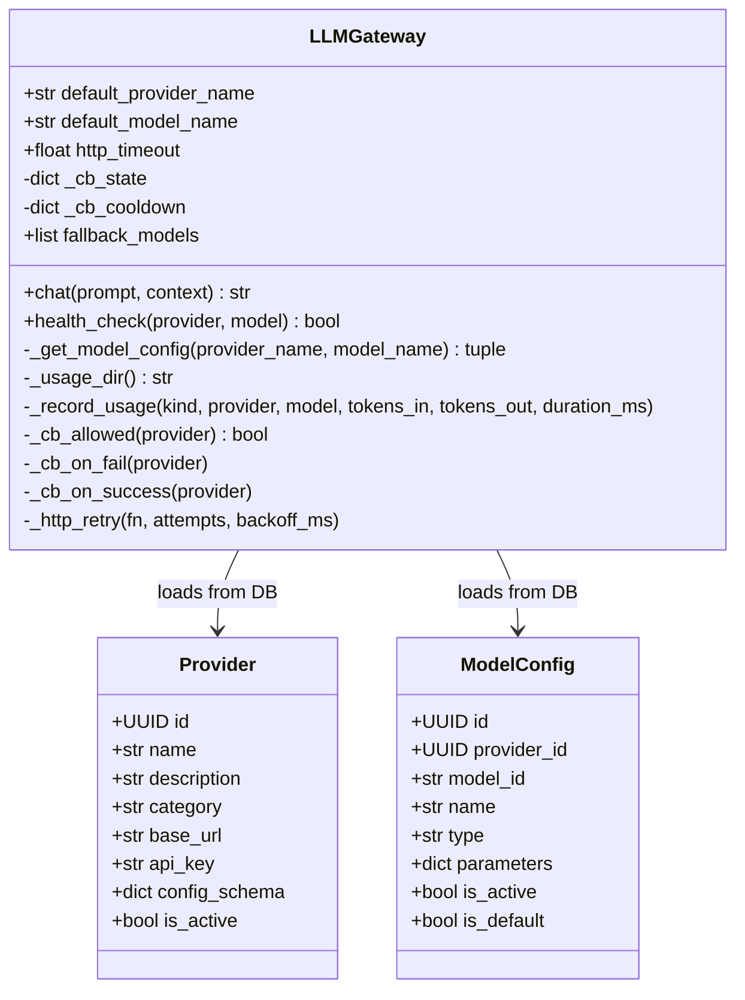
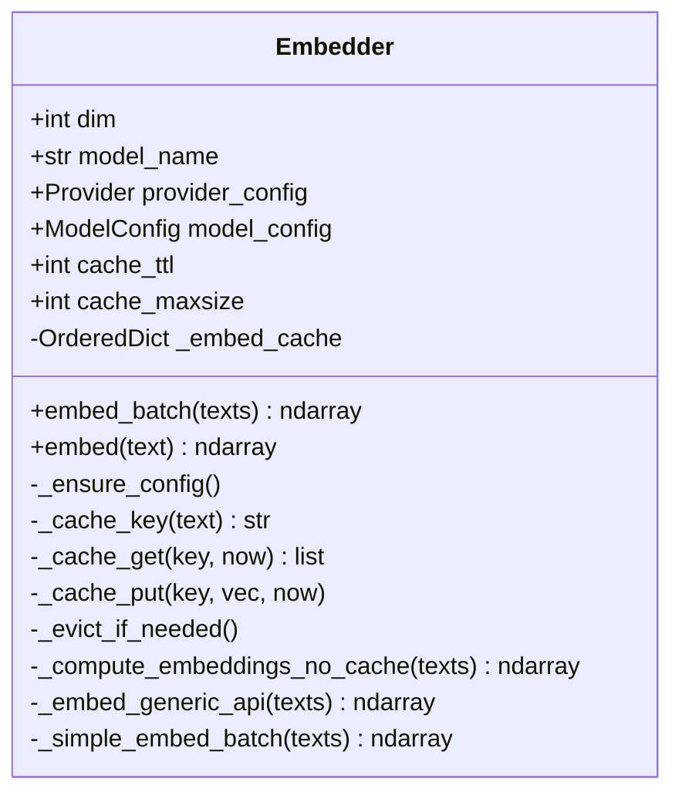
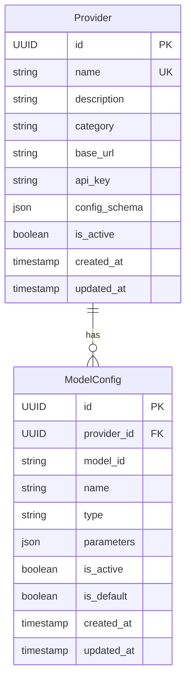

# Phase 1 现有实现分析

## 1. core/llm/gateway.py 分析

### 类图



### 现有功能分析

#### 1.1 DB 驱动的 Provider 加载 (`_get_model_config`)

```python
async def _get_model_config(self, provider_name, model_name) -> tuple[Provider, ModelConfig]:
    # 1. 先按 model_id 直接查询
    # 2. 再按 provider_name 查询
    # 3. 返回 (Provider, ModelConfig) 元组
```

**特点：**

- 支持按 model_id 直接查询（避免 provider 名大小写问题）
- 支持按 provider 名查询默认模型
- 使用 SQLAlchemy async session

#### 1.2 熔断/降级机制 (`_cb_*` 方法)

```python
def _cb_allowed(provider: str) -> bool:
    # 检查 provider 是否在冷却期内

def _cb_on_fail(provider: str):
    # 记录失败时间戳
    # 60秒窗口内3次失败 -> 熔断30秒

def _cb_on_success(provider: str):
    # 清除失败记录和冷却状态
```

**熔断参数：**

- 窗口期：60 秒
- 最大失败次数：3 次
- 冷却时间：30 秒

#### 1.3 用量记录 (`_record_usage`)

```python
def _record_usage(kind, provider, model, tokens_in, tokens_out, duration_ms):
    # 写入 data/usage/usage.jsonl
    # 记录格式：{ts, kind, provider, model, tokens_in, tokens_out, duration_ms}
```

**局限性：**

- 仅写入本地 JSONL 文件
- 无成本计算
- 无预算控制

### 可复用模式

1. **DB 驱动配置加载** - 可直接复用
2. **熔断机制** - 可增强支持 failover chain
3. **HTTP 重试** - 可直接复用

---

## 2. core/embedding/provider_embedder.py 分析

### 类图



### 现有功能分析

#### 2.1 DB 驱动的 Provider 配置 (`_ensure_config`)

```python
async def _ensure_config(self):
    # 1. 按 model_id 查询 ModelConfig
    # 2. 按 provider_id 查询 Provider
    # 3. 支持 fallback 到默认 embedding 模型
```

#### 2.2 LRU+TTL 缓存机制

```python
# 配置
cache_ttl = 900  # 15分钟
cache_maxsize = 1000

# 缓存结构
_embed_cache: OrderedDict[str, tuple[float, list[float]]]
# key: SHA256(text), value: (timestamp, embedding_vector)
```

**缓存策略：**

- LRU 淘汰：超过 maxsize 时淘汰最旧的
- TTL 过期：超过 ttl 时自动失效
- 命中时刷新 LRU 顺序

### 可复用模式

1. **LRU+TTL 缓存** - 可用于成本估算缓存
2. **Prometheus 指标** - 可用于成本追踪指标
3. **延迟加载配置** - 可用于 CostTracker

---

## 3. server/models.py 分析

### 现有模型



### 需要扩展的字段

**Provider 表扩展：**

- `priority` (INTEGER) - 路由优先级
- `endpoints` (JSONB) - 多端点配置
- `rate_limits` (JSONB) - 速率限制
- `is_healthy` (BOOLEAN) - 健康状态
- `last_health_check` (TIMESTAMP) - 最后健康检查时间
- `circuit_breaker_failures` (INTEGER) - 熔断失败计数
- `circuit_breaker_open_until` (TIMESTAMP) - 熔断开放时间

---

## 4. 架构决策总结

### ADR-001: 不创建 core/compute 模块

**原因：**

1. `core/llm/gateway.py` 已有完整的 Provider 管理能力
2. `core/embedding/provider_embedder.py` 已有 DB 驱动配置
3. 创建新模块会导致重复实现

**决定：** 增强现有 `core/llm/` 模块

### ADR-002: 扩展现有数据库表

**原因：**

1. `providers` 表已有 Provider 基本信息
2. `model_configs` 表已有模型配置
3. 新建重复表会导致数据不一致

**决定：**

- 扩展 `providers` 表
- 新建 `compute_cost_records` 表
- 新建 `budget_configs` 表
- 新建 `domain_configs` 表（Phase 2+ 预留）

---

## 5. 实现计划

### 新增文件

- `core/llm/cost_tracker.py` - 成本追踪器
- `core/llm/cost_estimator.py` - 成本估算器
- `core/storage/migrations/002_compute_infrastructure.sql` - 数据库迁移

### 修改文件

- `server/models.py` - 扩展 Provider，新增 ComputeCostRecord, BudgetConfig, DomainConfig
- `core/llm/gateway.py` - 增强路由策略、成本追踪、预算检查
- `core/llm/provider_config.py` - 扩展 Provider 配置
